# Tugas Pendahuluan
1. buat konfigurasi pada server PNET Lab berdasarkan topologi berikut ini **menggunakan node mikrotik**:
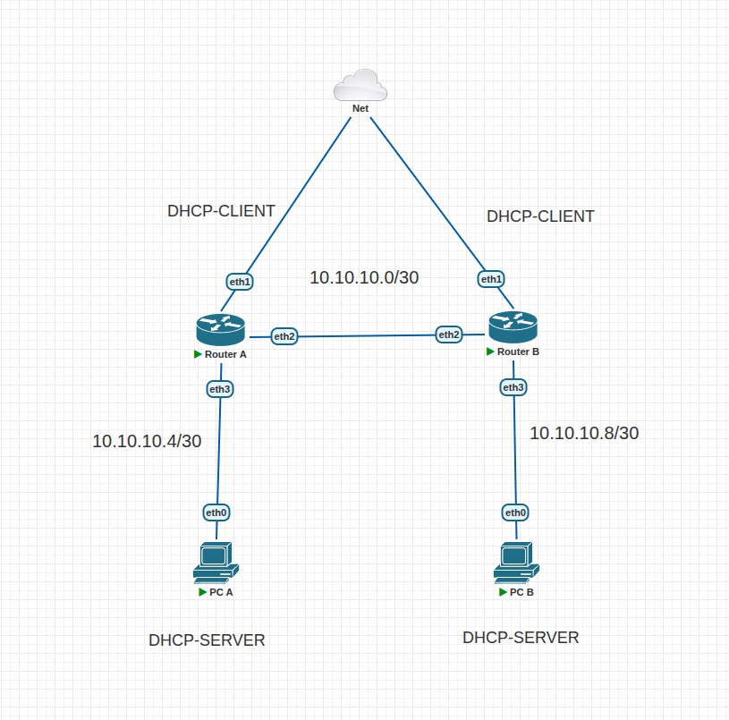

2. lakukan konfigurasi singkat menggunakan terminal pada server PNET Lab dengan urutan berikut:\
a. konfigurasi IP Address.\
b. konfigurasi DHCP Client agar terhubung dengan internet.\
c. konfigurasi DHCP Server router untuk PC A dan PC B.\
d. konfigurasi NAT agar PC A dan PC B bisa terhubung dengan internet.\
e. konfigurasi routing statis agar PC A dan PC B bisa saling terhubung (ping).\
*tidak boleh konfigurasi menggunakan GUI atau winbox.

4. lakukan test koneksi dengan ping antar pc dan koneksi internet dari masing masing pc.

lampirkan screenshot hasil topologi, konfigurasi, dan hasil test koneksi pada laporan.

**JANGAN LUPA MEMATIKAN LAB SERVER PNET SETELAH KALIAN SELESAI!**

bagi praktikan yang lupa mematikan lab server, **akan mendapatkan pengurangan poin.**

# Modul Firewall & NAT

## 1. Pengenalan Firewall
### 1.1 Apa itu Firewall?
"Coba bayangin firewall itu kayak satpam digital buat jaringan komputer kamu. Dia yang berdiri di gerbang jaringan buat ngecek siapa yang boleh masuk atau keluar."

Jadi, kalau ada data yang mau masuk atau keluar, firewall bakal lihat dulu aturannya: boleh lewat, ditolak sambil ngasih pesan error, atau langsung diabaikan kayak nggak pernah ada. Intinya, firewall ini bantu jagain komputer dari hal-hal yang nggak diinginkan kayak hacker atau virus.

Sebelum ada firewall, keamanan jaringan cuma pakai Access Control List (ACL), tapi ACL ini nggak bisa bedain isi dari data yang lewat. Jadinya, masih banyak celah yang bisa dimanfaatin sama orang jahat. Apalagi sekarang internet udah kayak kebutuhan pokok organisasi. Sayangnya, koneksi ke internet juga buka celah buat serangan dari luar. Nah, firewall hadir buat nutup celah itu dan jagain jaringan internal biar tetap aman.

### 1.2 Jenis-Jenis Firewall
1. **Packet Filtering**
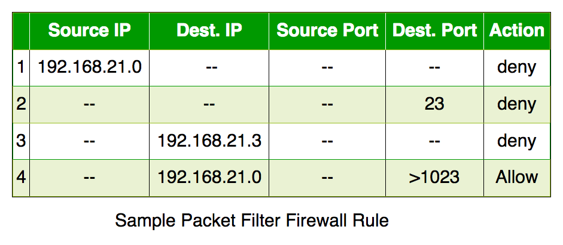
Cek satu per satu data yang lewat berdasarkan IP, port, dan protokol. Tapi dia nggak tahu ini bagian dari komunikasi yang mana, jadi agak kaku.

2. **Stateful Inspection**
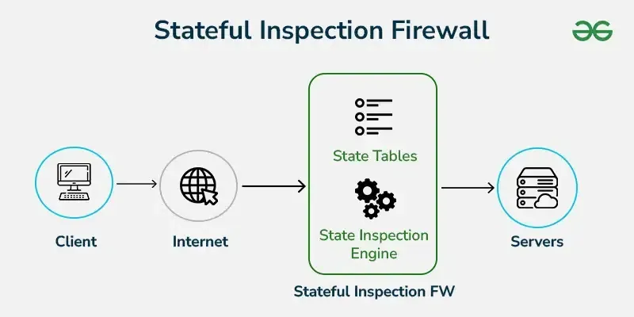
Lebih canggih, bisa tahu ini data udah bagian dari koneksi yang sah atau belum.

3. **Application Layer Firewall**
Bisa ngintip sampai ke isi aplikasi (kayak HTTP, FTP), bahkan bisa blokir konten tertentu. Biasanya pakai proxy.

4. **Next Generation Firewall (NGFW)**
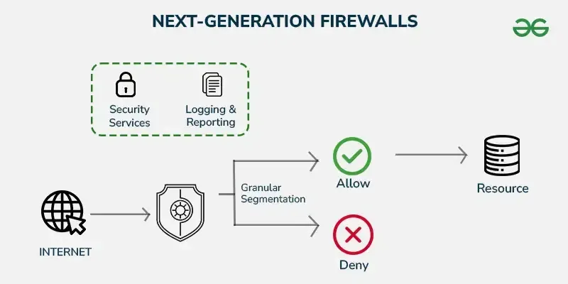
Ini firewall zaman now! Bisa cek isi data lebih dalam (deep packet inspection), termasuk enkripsi SSL.

5. **Circuit Level Gateway**
Kerja di level koneksi (session). Cuma lihat apakah koneksi udah sah atau belum, tapi nggak cek isi datanya. Jadi bisa lolos tuh malware.

6. **Software Firewall**
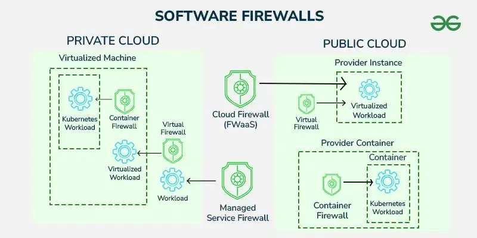
Dipasang di komputer atau server. Fleksibel tapi kadang berat dan makan waktu buat setting-nya.

7. **Hardware Firewall**
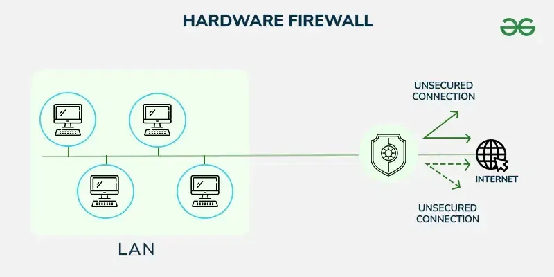
Bentuknya kayak perangkat fisik. Dipasang di antara internet dan jaringan internal, jadi bisa tahan serangan sebelum masuk lebih jauh.

8. **Cloud Firewall**
Firewall yang dijalankan di cloud. Cocok buat organisasi yang udah banyak pakai layanan cloud.

### 1.3 Cara Kerja Firewall
Firewall punya semacam buku aturan. Tiap data yang mau masuk atau keluar dicek dulu, sesuai atau nggak sama aturan itu. Misalnya, ada aturan yang bilang pegawai HRD nggak boleh akses server programmer—nah firewall bakal blokir tuh akses. Aturan bisa beda-beda tergantung kebutuhan dan kebijakan tiap organisasi.

**Kebijakan Akses di Firewall**
| Kebijakan | Penjelasan |
| --------- | ---------- |
| **Accept** | Dia yang memberikan izin lalu lintas data untuk bisa lewat. |
| **Reject** | Memblokir lalu lintas tapi memberikan balasan berupa *unreachable error* atau error yang tidak dapat dijangkau. |
| **Drop** | Memblokir lalu lintas tanpa memberikan balasan sama sekali. |


## 2. Network Address Translation (NAT)
### 2.1 Apa itu NAT?


Pernah bingung kenapa semua orang bisa internetan padahal IP publik di dunia ini terbatas? Nah, di sinilah NAT jadi penyelamat. 

"NAT itu semacam trik pintar yang bikin banyak perangkat di rumah atau kantor kamu bisa akses internet pakai satu IP publik aja."

Jadi meskipun cuma punya satu “alamat rumah” di dunia maya, banyak “penghuni” tetap bisa kirim dan terima data. Coba bayangin: alamat IPv4 yang tersedia cuma sekitar 4,3 miliar. Padahal perangkat yang nyambung ke internet udah lebih dari itu. Kalau tiap perangkat butuh satu IP publik, alamat bakal cepat habis. Nah, dengan NAT, cukup satu IP publik buat satu jaringan lokal, terus semua perangkat di jaringan itu bisa internetan bareng lewat IP publik yang sama.

### 2.2 Jenis-Jenis NAT
1. **Static NAT**
Satu IP lokal dihubungkan ke satu IP publik (one-to-one). Jarang dipakai karena mahal dan boros IP publik. Cocok buat server yang butuh alamat tetap, misalnya buat hosting website.

2. **Dynamic NAT**
IP lokal diubah ke IP publik dari kumpulan (pool) IP yang tersedia. Kalau IP di pool habis, permintaan koneksi ditolak. Tetap butuh banyak IP publik.

3. **Port Address Translation (PAT)**
Ini yang paling sering dipakai. Banyak IP lokal bisa pakai satu IP publik dengan membedakan tiap koneksi berdasarkan port. Hemat dan efisien!

### 2.3 Cara Kerja NAT
Biasanya, NAT ini ada di router yang jadi penghubung antara jaringan lokal dan internet. Kalau ada perangkat di dalam jaringan lokal kirim data ke internet, alamat IP-nya bakal diubah jadi alamat IP publik dulu sama router. Pas data dari internet mau balik ke perangkat tadi, NAT akan ganti lagi alamat publik itu jadi IP lokal si pengirim. Semuanya dicatat rapi di "tabel NAT" biar nggak bingung.

Bayangin dua orang dari satu rumah (misalnya laptop A dan B) buka website yang sama di waktu yang sama, pakai port yang sama. Kalau cuma IP yang diubah, pas server balikin datanya, router bingung: data ini buat A atau B? Makanya, NAT juga ngubah nomor port, jadi bisa bedain mana data buat siapa.

### 2.4 Istilah Penting di NAT


| Istilah | Penjelasan |
| ------- | ---------- |
| **Inside Local Address** | IP lokal perangkat di jaringan dalam (biasanya IP privat kayak 192.168.x.x) |
| **Inside Global Address** | IP publik yang mewakili perangkat dari dalam jaringan ke dunia luar |
| **Outside Local Address** | IP tujuan dari sisi luar yang udah diterjemahin di dalam jaringan |
| **Outside Global Address** | IP asli dari tujuan di luar jaringan |

## 3. Connection Tracking
### 3.1 Apa itu Connection Tracking?
**Connection Tracking** (pelacakan koneksi) adalah fitur **"pengamat lalu lintas jaringan"** yang cerdas. Ia mencatat siapa yang sedang ngobrol dengan siapa, kapan mulai ngobrol, lewat jalur mana (IP & port), dan apakah obrolan itu masih aktif atau sudah selesai.

> Bayangkan kamu punya resepsionis jaringan yang mencatat semua pengunjung (paket data) yang masuk dan keluar. Kalau ada pengunjung yang balik lagi (paket balasan), resepsionis akan mengenalinya dan langsung mengizinkannya masuk, tanpa perlu tanya-tanya lagi.

Connection Tracking ini melakukan **manajemen trafik** dengan cara menyimpan informasi penting dari koneksi tersebut seperti:
- Source Address
- Destination Address
- Source Port
- Destination Port
- Protocol
- Connection State

Label ini sangat penting terutama untuk proses **firewall filtering** dan **NAT** karena memungkinkan router **mengenali status dari setiap paket data** yang lewat.

### 3.2 Cara Kerja Connection Tracking
Saat kamu **mengakses website**:
1. Komputer kamu mengirim permintaan ke server (misalnya IP `8.8.8.8`).
2. Connection tracking mencatat: "Oke, koneksi baru dari `192.168.1.10` ke `8.8.8.8:80`".
3. Server membalas → sistem tahu ini **balasan sah** dan langsung diizinkan.
4. Kalau ada koneksi aneh dari luar yang belum pernah dicatat → **langsung ditolak** (state: `invalid`).

### 3.3 Manfaat Connection Tracking
Connection Tracking memberikan banyak keuntungan dalam pengelolaan dan pengamanan jaringan. Berikut beberapa manfaat utamanya:
1. Keamanan yang Lebih Baik (Stateful Firewall)
2. Mendukung NAT Secara Efisien
3. Mengurangi Beban Router
4. Kontrol Lebih Detail terhadap Lalu Lintas Jaringan
5. Mendeteksi dan Menghentikan Koneksi Tidak Sah

# TAHAPAN PRAKTIKUM

## Praktikum 1: Firewall NAT Dasar

**Langkah 0: buat topologi seperti berikut:**
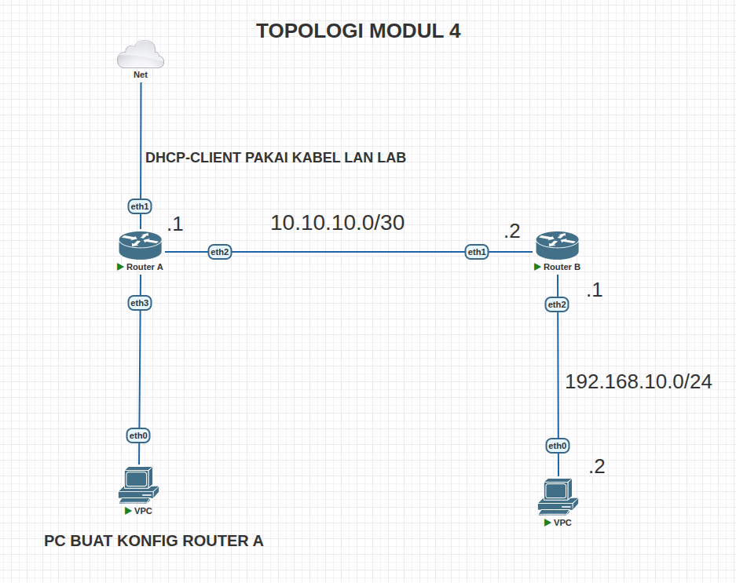

**Langkah 1: Reset Konfigurasi Router**
Pastikan router telah di-reset ke kondisi awal (tanpa konfigurasi) agar tidak terjadi konflik pada konfigurasi berikutnya.
1. Gunakan aplikasi **Winbox** untuk mengakses router.
2. Masuk ke menu **System** -> **Reset Configuration**.
3. Ceklis pada kotak **No Default Configuration**.
4. Klik tombol **Reset Configuration**.

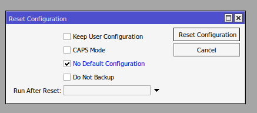

**Langkah 2: Konfigurasi DHCP Client pada Router A (ether1)**
Sambungkan port **ether1** pada Router A ke jaringan Lab/Internet, lalu atur DHCP Client agar router mendapat IP otomatis.
1. Masuk ke menu **IP** -> **DHCP Client**.
2. Klik tombol **+** (Add) untuk menambahkan entri baru.
3. Pilih **ether1** pada kolom **Interface**.
4. Klik **Apply** lalu **OK**.
5. Pastikan status koneksi berubah menjadi **bound**.

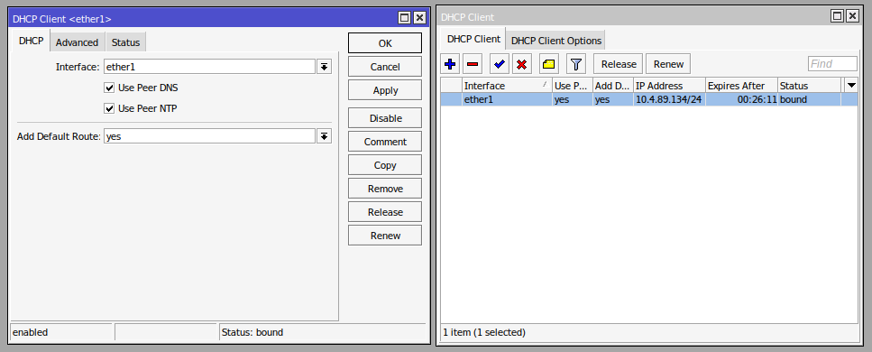

**Langkah 3: Konfigurasi IP Address di Router A (ether2)**
Tambahkan IP Address pada interface **ether2** Router A sebagai jalur penghubung ke Router B.
1. Masuk ke menu **IP** -> **Addresses**.
2. Klik tombol **+** (Add).
3. Masukkan **Address**: `10.10.10.1/30`.
4. Pilih **Interface**: `ether2`.
5. Klik **Apply** lalu **OK**.

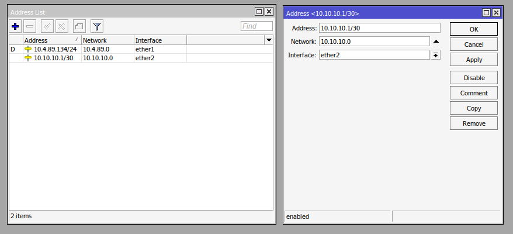

**Langkah 4: Konfigurasi Routing Statis di Router A**
Atur routing statis agar Router A tahu rute menuju jaringan lokal PC Client yang ada di belakang Router B.
1. Masuk ke menu **IP** -> **Routes**.
2. Klik tombol **+** (Add).
3. Isi **Dst. Address**: `192.168.10.0/24`.
4. Isi **Gateway**: `10.10.10.2`.
5. Klik **Apply** lalu **OK**.

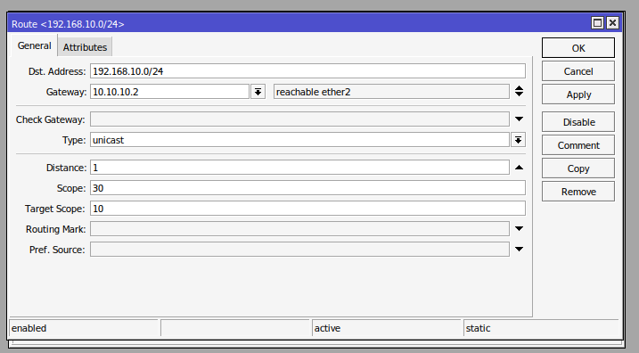

**Langkah 5: Konfigurasi IP Address di Router B (ether2)**
Pada Router B, tambahkan IP Address di **ether2** yang mengarah ke PC Client.
1. Buka Winbox untuk Router B.
2. Masuk ke menu **IP** -> **Addresses**.
3. Klik tombol **+** (Add).
4. Masukkan **Address**: `192.168.10.1/24`.
5. Pilih **Interface**: `ether2`.
6. Klik **Apply** lalu **OK**.
7. Abaikan ip pada ether3.
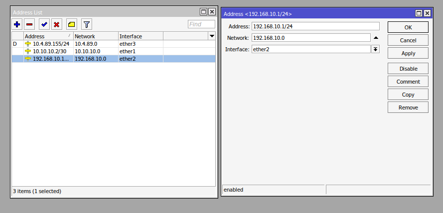

**Langkah 6: Konfigurasi IP Address di Router B (ether1)**
Tambahkan juga IP Address di **ether1** Router B yang mengarah ke Router A.
1. Masih di menu **IP** -> **Addresses**, klik tombol **+** (Add).
2. Masukkan **Address**: `10.10.10.2/30`.
3. Pilih **Interface**: `ether1`.
4. Klik **Apply** lalu **OK**.

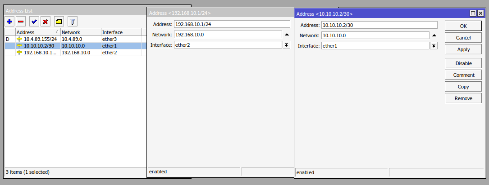

**Langkah 7: Konfigurasi Default Route di Router B**
Atur *default route* agar semua paket dari jaringan lokal Router B dikirim ke Router A (menuju internet).
1. Masuk ke menu **IP** -> **Routes**.
2. Klik tombol **+** (Add).
3. Biarkan **Dst. Address** tetap `0.0.0.0/0`.
4. Isi **Gateway**: `10.10.10.1`.
5. Klik **Apply** lalu **OK**.

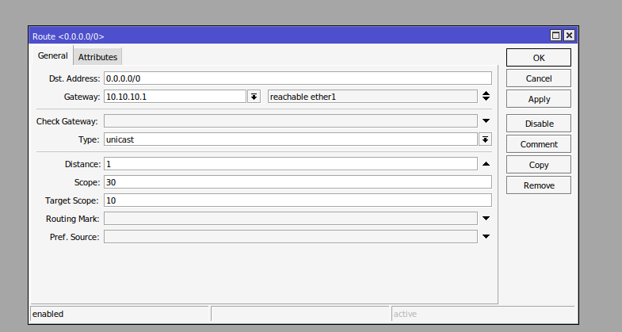

**Langkah 8: Konfigurasi Firewall NAT di Router B**
Bikin aturan NAT (Network Address Translation) di Router B agar jaringan lokal bisa ikut internetan pakai IP publik router.
1. Kembali ke Winbox Router B , masuk ke menu **IP** -> **Firewall** -> tab **NAT**.
2. Klik tombol **+** (Add) untuk membuat aturan baru.
3. Pada tab **General**, ubah **Chain** menjadi `srcnat`.
4. Atur **Out. Interface** menjadi `ether1`.

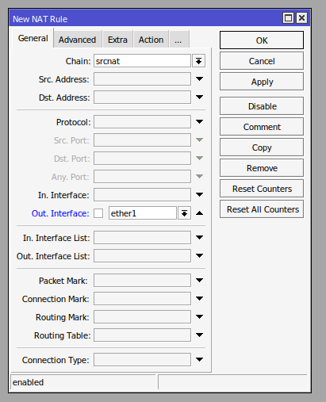

5. Geser ke tab **Action**, ubah **Action** menjadi `masquerade`.
6. Klik **Apply** lalu **OK**.

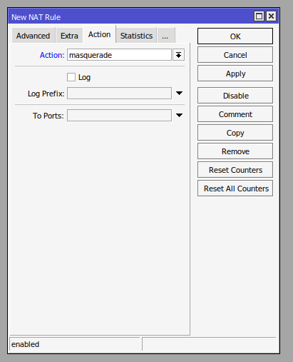

7. Pastikan aturan NAT sudah masuk ke dalam daftar.


**Langkah 9: Konfigurasi IP Statis di PC Client**
Atur IP statis pada laptop/PC Client agar bisa terhubung ke Router B.
1. Buka pengaturan Network (di Windows: **Control Panel -> Network and Sharing Center -> Change adapter settings**).
2. Klik kanan pada Ethernet, pilih **Properties**.
3. Buka **Internet Protocol Version 4 (TCP/IPv4)**.
4. Pilih **Use the following IP address** dan isi:
   - **IP address**: `192.168.10.2`
   - **Subnet mask**: `255.255.255.0`
   - **Default gateway**: `192.168.10.1`
5. Isi DNS server (misal: `8.8.8.8`).
6. Klik **OK**.


**Langkah 10: Pengujian Jaringan dari PC Client**
Coba tes ping dari Command Prompt (CMD) di PC Client untuk memastikan routing dan NAT sudah berjalan sukses.
1. Buka CMD.
2. Ping ke Gateway Router B: `ping 192.168.10.1`.
3. Ping ke Gateway Router A: `ping 10.10.10.1`.
4. Ping ke IP internet/Lab (contoh IP DHCP Router A): `ping 10.4.89.134`.
5. Pastikan semuanya mendapatkan *Reply*!


## Praktikum 2: Firewall Filter (Input vs Forward)
*(Praktikum ini adalah lanjutan dari Praktikum 1. Pastikan konfigurasi sebelumnya sudah berjalan dengan baik)*

**Langkah 1: Konfigurasi Firewall Filter (Chain Input)**
Kita akan mencoba memblokir trafik *ping* dari Router A yang ditujukan ke Router B.
1. Buka Winbox **Router B**.
2. Masuk ke menu **IP** -> **Firewall** -> tab **Filter Rules**.
3. Klik tombol **+** (Add) untuk membuat aturan baru.
4. Pada tab **General**, atur:
   - **Chain**: `input`
   - **Src. Address**: `10.10.10.1` (IP Router A)
   - **Protocol**: `icmp`

   

5. Geser ke tab **Action**, atur **Action**: `drop`.

   

6. Klik **Apply** lalu **OK**. Pastikan aturan sudah ditambahkan ke dalam daftar.

   

**Langkah 2: Pengujian Chain Input dari Router A**
1. Buka **New Terminal** di Winbox **Router A**.
2. Lakukan ping ke IP Router B:
   ```bash
   ping 10.10.10.2
   ```
   *Hasilnya harus Timeout, karena paket masuk yang ditujukan langsung ke Router B diblokir oleh chain input.*
3. Lakukan ping ke IP PC Client yang berada di belakang Router B:
   ```bash
   ping 192.168.10.2
   ```
   *Hasilnya harus Reply, karena paket ini hanya numpang lewat Router B (chain forward).*

   

**Langkah 3: Konfigurasi Firewall Filter (Chain Forward)**
Sekarang kita biarkan Router A nge-ping Router B, tapi memblokir Router A jika nge-ping PC Client.
1. Di Winbox **Router B**, matikan (disable) aturan `input` sebelumnya. Klik aturan tersebut lalu tekan tombol **Silang (X)**.
2. Klik tombol **+** (Add) untuk membuat aturan baru.
3. Pada tab **General**, atur:
   - **Chain**: `forward`
   - **Src. Address**: `10.10.10.1`
   - **Protocol**: `icmp`

   

4. Geser ke tab **Action**, atur **Action**: `drop`.

   

5. Klik **Apply** lalu **OK**. Pastikan aturan forward aktif dan aturan input lama berstatus silang abu-abu (disable).

   

**Langkah 4: Pengujian Chain Forward dari Router A**
1. Kembali ke **New Terminal** di **Router A**.
2. Lakukan ping ke IP Router B:
   ```bash
   ping 10.10.10.2
   ```
   *Hasilnya harus Reply, karena aturan input sudah dimatikan.*
3. Lakukan ping ke IP PC Client:
   ```bash
   ping 192.168.10.2
   ```
   *Hasilnya harus Timeout, karena paket yang melewati Router B menuju PC Client diblokir oleh chain forward.*

   
## Praktikum 3: Firewall NAT Forwarding (Port Forwarding)
*(Praktikum ini menggunakan topologi dasar Praktikum 1. Sebelum mulai, pastikan kamu menghapus/disable semua aturan Firewall Filter Rules dari Praktikum 2 agar trafik tidak terblokir)*

Pada praktikum ini, kita akan membuat PC Client bertindak sebagai Web Server. Karena PC Client berada di jaringan lokal (privat), komputer dari luar (seperti Router A) tidak bisa mengaksesnya secara langsung. Kita butuh **Destination NAT (DstNAT)** di Router B untuk membelokkan trafik yang masuk.

**Langkah 1: Konfigurasi Port Forwarding (DstNAT) di Router B**
Kita akan mengatur agar siapa pun yang mengakses IP Router B (`10.10.10.2`) melalui port `8080` akan diarahkan ke Web Server PC Client (`192.168.10.2`) port `80`.
1. Buka Winbox **Router B**.
2. Masuk ke menu **IP** -> **Firewall** -> tab **NAT**.
3. Klik tombol **+** (Add) untuk menambahkan aturan baru.
4. Pada tab **General**, atur:
   - **Chain**: `dstnat`
   - **Dst. Address**: `10.10.10.2` (IP Router B yang mengarah ke Router A)
   - **Protocol**: `6 (tcp)`
   - **Dst. Port**: `8080`

   

5. Geser ke tab **Action**, atur:
   - **Action**: `dst-nat`
   - **To Addresses**: `192.168.10.2` (IP PC Client)
   - **To Ports**: `80` (Port web server lokal)

   

6. Klik **Apply** lalu **OK**. Pastikan aturan tersebut sudah muncul di daftar NAT (berdampingan dengan aturan *masquerade* sebelumnya).

   

**Langkah 2: Menjalankan Web Server di PC Client**
Setelah aturannya siap, sekarang kita nyalakan web server-nya. Kita akan membuat web server sementara menggunakan Python.
1. Buka **Command Prompt (CMD)** di PC Client.
2. Ketikkan perintah berikut lalu tekan Enter:
   ```bash
   python -m http.server 80
   ```
3. Biarkan jendela CMD tetap terbuka agar server tetap menyala.

   

**Langkah 3: Pengujian Port Forwarding dari Router A**
Sekarang kita posisikan Router A sebagai pihak dari luar yang ingin mengakses Web Server di PC Client.
1. Buka **New Terminal** di Winbox **Router A**.
2. Ketikkan perintah *fetch* untuk mengunduh halaman dari web server melalui IP Router B (port `8080`):
   ```bash
   /tool fetch url="http://10.10.10.2:8080" keep-result=no
   ```
3. Jika berhasil, statusnya akan menunjukkan proses *connecting* dan mengunduh file tanpa error. Artinya, trafik ke port 8080 Router B berhasil dibelokkan (NAT Forwarding) ke PC Client!

   

**Langkah 4: Mengamati Connection Tracking**
Kamu juga bisa melihat bagaimana Router B melacak perubahan port dan alamat IP ini.
1. Di Winbox **Router B**, masih di menu **IP** -> **Firewall**, buka tab **Connections**.
2. Perhatikan daftar yang muncul saat Router A mencoba mengakses web server. Kamu akan melihat catatan koneksi dari IP `10.10.10.1` ke `10.10.10.2:8080` sedang berstatus *established/syn received*.

   

3. perhatikan pada terminal router A, akan mendapatkan response dari web server PC Client. lalu cek ulang pada firewall filter connection router B.
4. dokumentasikan hasil terminal router A dan firewall filter connection router B.  

# TUGAS MODUL
*(Akan menyusul)*
