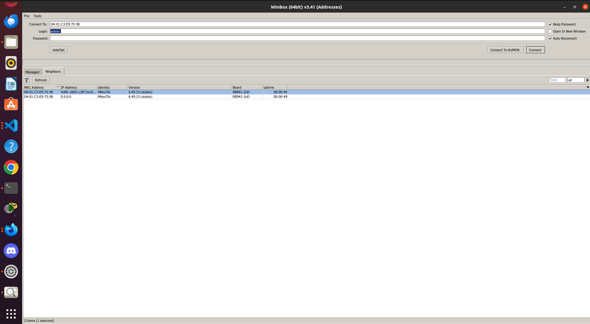

# Tugas Pendahuluan
1. buat konfigurasi pada server PNET Lab berdasarkan topologi berikut ini **menggunakan node mikrotik**:


2. lakukan konfigurasi singkat pada server PNET Lab dengan urutan berikut:\
a. konfigurasi IP Address.\
b. konfigurasi DHCP Client agar terhubung dengan internet.\
c. konfigurasi DHCP Server router untuk PC A dan PC B.\
d. konfigurasi NAT agar PC A dan PC B bisa terhubung dengan internet.\
e. konfigurasi routing statis agar PC A dan PC B bisa saling terhubung (ping).

3. lakukan test koneksi dengan ping antar pc dan koneksi internet dari masing masing pc.

lampirkan screenshot hasil topologi, konfigurasi, dan hasil test koneksi pada laporan.

**JANGAN LUPA MEMATIKAN LAB SERVER PNET SETELAH KALIAN SELESAI!**

bagi praktikan yang lupa mematikan lab server, **akan mendapatkan pengurangan poin.**

# Modul Firewall & NAT

## 1. Pengenalan Firewall
### 1.1 Apa itu Firewall?
"Coba bayangin firewall itu kayak satpam digital buat jaringan komputer kamu. Dia yang berdiri di gerbang jaringan buat ngecek siapa yang boleh masuk atau keluar."

Jadi, kalau ada data yang mau masuk atau keluar, firewall bakal lihat dulu aturannya: boleh lewat, ditolak sambil ngasih pesan error, atau langsung diabaikan kayak nggak pernah ada. Intinya, firewall ini bantu jagain komputer dari hal-hal yang nggak diinginkan kayak hacker atau virus.

Sebelum ada firewall, keamanan jaringan cuma pakai Access Control List (ACL), tapi ACL ini nggak bisa bedain isi dari data yang lewat. Jadinya, masih banyak celah yang bisa dimanfaatin sama orang jahat. Apalagi sekarang internet udah kayak kebutuhan pokok organisasi. Sayangnya, koneksi ke internet juga buka celah buat serangan dari luar. Nah, firewall hadir buat nutup celah itu dan jagain jaringan internal biar tetap aman.

### 1.2 Jenis-Jenis Firewall
1. **Packet Filtering**

Cek satu per satu data yang lewat berdasarkan IP, port, dan protokol. Tapi dia nggak tahu ini bagian dari komunikasi yang mana, jadi agak kaku.

2. **Stateful Inspection**

Lebih canggih, bisa tahu ini data udah bagian dari koneksi yang sah atau belum.

3. **Application Layer Firewall**
Bisa ngintip sampai ke isi aplikasi (kayak HTTP, FTP), bahkan bisa blokir konten tertentu. Biasanya pakai proxy.

4. **Next Generation Firewall (NGFW)**

Ini firewall zaman now! Bisa cek isi data lebih dalam (deep packet inspection), termasuk enkripsi SSL.

5. **Circuit Level Gateway**
Kerja di level koneksi (session). Cuma lihat apakah koneksi udah sah atau belum, tapi nggak cek isi datanya. Jadi bisa lolos tuh malware.

6. **Software Firewall**

Dipasang di komputer atau server. Fleksibel tapi kadang berat dan makan waktu buat setting-nya.

7. **Hardware Firewall**

Bentuknya kayak perangkat fisik. Dipasang di antara internet dan jaringan internal, jadi bisa tahan serangan sebelum masuk lebih jauh.

8. **Cloud Firewall**
Firewall yang dijalankan di cloud. Cocok buat organisasi yang udah banyak pakai layanan cloud.

### 1.3 Cara Kerja Firewall
Firewall punya semacam buku aturan. Tiap data yang mau masuk atau keluar dicek dulu, sesuai atau nggak sama aturan itu. Misalnya, ada aturan yang bilang pegawai HRD nggak boleh akses server programmer—nah firewall bakal blokir tuh akses. Aturan bisa beda-beda tergantung kebutuhan dan kebijakan tiap organisasi.

**Kebijakan Akses di Firewall**
| Kebijakan | Penjelasan |
| --------- | ---------- |
| **Accept** | Dia yang memberikan izin lalu lintas data untuk bisa lewat. |
| **Reject** | Memblokir lalu lintas tapi memberikan balasan berupa *unreachable error* atau error yang tidak dapat dijangkau. |
| **Drop** | Memblokir lalu lintas tanpa memberikan balasan sama sekali. |


## 2. Network Address Translation (NAT)
### 2.1 Apa itu NAT?


Pernah bingung kenapa semua orang bisa internetan padahal IP publik di dunia ini terbatas? Nah, di sinilah NAT jadi penyelamat. 

"NAT itu semacam trik pintar yang bikin banyak perangkat di rumah atau kantor kamu bisa akses internet pakai satu IP publik aja."

Jadi meskipun cuma punya satu “alamat rumah” di dunia maya, banyak “penghuni” tetap bisa kirim dan terima data. Coba bayangin: alamat IPv4 yang tersedia cuma sekitar 4,3 miliar. Padahal perangkat yang nyambung ke internet udah lebih dari itu. Kalau tiap perangkat butuh satu IP publik, alamat bakal cepat habis. Nah, dengan NAT, cukup satu IP publik buat satu jaringan lokal, terus semua perangkat di jaringan itu bisa internetan bareng lewat IP publik yang sama.

### 2.2 Jenis-Jenis NAT
1. **Static NAT**
Satu IP lokal dihubungkan ke satu IP publik (one-to-one). Jarang dipakai karena mahal dan boros IP publik. Cocok buat server yang butuh alamat tetap, misalnya buat hosting website.

2. **Dynamic NAT**
IP lokal diubah ke IP publik dari kumpulan (pool) IP yang tersedia. Kalau IP di pool habis, permintaan koneksi ditolak. Tetap butuh banyak IP publik.

3. **Port Address Translation (PAT)**
Ini yang paling sering dipakai. Banyak IP lokal bisa pakai satu IP publik dengan membedakan tiap koneksi berdasarkan port. Hemat dan efisien!

### 2.3 Cara Kerja NAT
Biasanya, NAT ini ada di router yang jadi penghubung antara jaringan lokal dan internet. Kalau ada perangkat di dalam jaringan lokal kirim data ke internet, alamat IP-nya bakal diubah jadi alamat IP publik dulu sama router. Pas data dari internet mau balik ke perangkat tadi, NAT akan ganti lagi alamat publik itu jadi IP lokal si pengirim. Semuanya dicatat rapi di "tabel NAT" biar nggak bingung.

Bayangin dua orang dari satu rumah (misalnya laptop A dan B) buka website yang sama di waktu yang sama, pakai port yang sama. Kalau cuma IP yang diubah, pas server balikin datanya, router bingung: data ini buat A atau B? Makanya, NAT juga ngubah nomor port, jadi bisa bedain mana data buat siapa.

### 2.4 Istilah Penting di NAT


| Istilah | Penjelasan |
| ------- | ---------- |
| **Inside Local Address** | IP lokal perangkat di jaringan dalam (biasanya IP privat kayak 192.168.x.x) |
| **Inside Global Address** | IP publik yang mewakili perangkat dari dalam jaringan ke dunia luar |
| **Outside Local Address** | IP tujuan dari sisi luar yang udah diterjemahin di dalam jaringan |
| **Outside Global Address** | IP asli dari tujuan di luar jaringan |

## 3. Connection Tracking
### 3.1 Apa itu Connection Tracking?
**Connection Tracking** (pelacakan koneksi) adalah fitur **"pengamat lalu lintas jaringan"** yang cerdas. Ia mencatat siapa yang sedang ngobrol dengan siapa, kapan mulai ngobrol, lewat jalur mana (IP & port), dan apakah obrolan itu masih aktif atau sudah selesai.

> Bayangkan kamu punya resepsionis jaringan yang mencatat semua pengunjung (paket data) yang masuk dan keluar. Kalau ada pengunjung yang balik lagi (paket balasan), resepsionis akan mengenalinya dan langsung mengizinkannya masuk, tanpa perlu tanya-tanya lagi.

Connection Tracking ini melakukan **manajemen trafik** dengan cara menyimpan informasi penting dari koneksi tersebut seperti:
- Source Address
- Destination Address
- Source Port
- Destination Port
- Protocol
- Connection State

Label ini sangat penting terutama untuk proses **firewall filtering** dan **NAT** karena memungkinkan router **mengenali status dari setiap paket data** yang lewat.

### 3.2 Cara Kerja Connection Tracking
Saat kamu **mengakses website**:
1. Komputer kamu mengirim permintaan ke server (misalnya IP `8.8.8.8`).
2. Connection tracking mencatat: "Oke, koneksi baru dari `192.168.1.10` ke `8.8.8.8:80`".
3. Server membalas → sistem tahu ini **balasan sah** dan langsung diizinkan.
4. Kalau ada koneksi aneh dari luar yang belum pernah dicatat → **langsung ditolak** (state: `invalid`).

### 3.3 Manfaat Connection Tracking
Connection Tracking memberikan banyak keuntungan dalam pengelolaan dan pengamanan jaringan. Berikut beberapa manfaat utamanya:
1. Keamanan yang Lebih Baik (Stateful Firewall)
2. Mendukung NAT Secara Efisien
3. Mengurangi Beban Router
4. Kontrol Lebih Detail terhadap Lalu Lintas Jaringan
5. Mendeteksi dan Menghentikan Koneksi Tidak Sah

<!-- # TAHAPAN PRAKTIKUM

## Praktikum 1: Konfigurasi Firewall & NAT Dasar

**Langkah 1: Reset Konfigurasi Router**
Pastikan router telah di-reset ke kondisi awal (tanpa konfigurasi) agar tidak terjadi konflik pada konfigurasi berikutnya.
1. Gunakan aplikasi **Winbox** untuk mengakses router.
2. Masuk ke menu **System** -> **Reset Configuration**.
3. Ceklis pada kotak **No Default Configuration**.
4. Klik tombol **Reset Configuration**.


**Langkah 2: Login ke Router**
1. Buka kembali **Winbox**.
2. Klik *MAC Address* atau IP default router pada tab **Neighbors**.
3. Isi kolom *Login* dengan `admin` dan kosongkan kolom *Password*.
4. Klik tombol **Connect**.



**Langkah 3: Konfigurasi DHCP Client pada Router A (ether1)**
Sambungkan kabel internet ke port **ether1** pada Router A, lalu konfigurasi DHCP Client biar router dapet koneksi internet dari ISP.
1. Masuk ke menu **IP** -> **DHCP Client**.
2. Klik tombol **+** (Add) untuk menambahkan entri baru.
3. Pilih **ether1** pada kolom **Interface**.
4. Klik **Apply** lalu **OK**.
5. Pastikan status koneksi sudah berubah menjadi **bound**.


**Langkah 4: Penambahan Alamat IP pada ether7**
Tambahkan IP Address pada interface **ether7** sebagai jalur penghubung ke Switch lokal.
1. Masuk ke menu **IP** -> **Addresses**.
2. Klik tombol **+** (Add) untuk menambahkan IP.
3. Masukkan **Address**: `192.168.10.1/24`.
4. Pilih **Interface**: `ether7`.
5. Klik **Apply** lalu **OK**.


**Langkah 5: Setup DHCP Server**
Atur DHCP Server biar laptop praktikan yang terhubung bisa dapet IP Address secara otomatis.
1. Masuk ke menu **IP** -> **DHCP Server** -> tab **DHCP**.
2. Klik tombol **DHCP Setup**.
3. Pilih interface **ether7** sebagai jalur pembagian IP, lalu klik **Next**.
4. Klik **Next** terus untuk mengikuti petunjuk wizard sampai selesai (konfigurasi IP space, gateway, range IP, DNS, dan lease time biarkan *default* bawaan sistem).
5. Setelah selesai, bakal muncul pop-up "*Setup has completed successfully*", klik **OK**.


**Langkah 6: Konfigurasi NAT**
Bikin aturan NAT (Network Address Translation) biar semua perangkat di jaringan lokal bisa ikut internetan pakai IP publik router.
1. Masuk ke menu **IP** -> **Firewall** -> tab **NAT**.
2. Klik tombol **+** (Add) untuk membuat aturan baru.
3. Pada tab **General**, ubah **Chain** menjadi `srcnat`.
4. Geser ke tab **Action**, ubah **Action** menjadi `masquerade`.
5. Klik **Apply** lalu **OK**.
6. Buat tes koneksi, buka **New Terminal** di Winbox dan coba ping:
   ```bash
   ping 8.8.8.8
   ```
   Pastikan hasilnya memunculkan balasan (*Reply*).


**Langkah 7: Konfigurasi Firewall Filtering**
Tambahkan aturan filter (*Filter Rules*) pada firewall untuk mengamankan lalu lintas data di jaringan.
1. Masuk ke menu **IP** -> **Firewall** -> tab **Filter Rules**.
2. Klik tombol **+** (Add) untuk membuat aturan firewall baru.

**Pemblokiran Ping (ICMP Test):**
- Pada tab **General**, atur:
  - **Chain**: `forward`
  - **Protocol**: `icmp`
  - **In. Interface**: `ether7`
- Geser ke tab **Action**, atur **Action**: `drop`
- Klik **Apply** lalu **OK**.

**Pemblokiran Situs Web Berdasarkan Konten (Content Blocking):**
1. Klik tombol **+** (Add) untuk membuat aturan baru.
2. Pada tab **General**, atur:
  - **Chain**: `forward`
  - **Protocol**: `tcp`
  - **Dst. Port**: `80,443` (port untuk akses HTTP dan HTTPS)
  - **In. Interface**: `ether7`
  - **Out. Interface**: `ether1`
3. Pindah ke tab **Advanced**, isi kolom **Content**: `speedtest`
4. Geser ke tab **Action**, atur **Action**: `drop`
5. Klik **Apply** lalu **OK**.


**Langkah 8: Konfigurasi Bridge pada Router B**
Bikin konfigurasi Bridge pada Router B biar fungsinya berubah menjadi *switch/hub* biasa.
1. Masuk ke menu **Bridge** -> tab **Bridges**.
2. Klik tombol **+** (Add) untuk membuat interface bridge baru.
3. Kasih nama `bridge1`, lalu klik **Apply** dan **OK**.
4. Pindah ke tab **Ports**, klik tombol **+** (Add) untuk memasukkan port jaringan ke dalam jembatan bridge:
   - Tambahkan port yang terhubung ke laptop praktikan ke dalam `bridge1`.
   - Tambahkan port yang terhubung ke Router A ke dalam `bridge1`.


**Langkah 9: Konfigurasi IP Address di Laptop**
Atur konfigurasi jaringan laptop biar mendapatkan IP secara otomatis dari DHCP Server Router A.
1. Di laptopmu, buka **Control Panel** -> **Network and Sharing Center** -> **Change adapter settings**.
2. Klik kanan pada interface Ethernet yang tersambung, pilih **Properties**.
3. Pilih **Internet Protocol Version 4 (TCP/IPv4)**, lalu klik **Properties**.
4. Ceklis pada pilihan **Obtain an IP address automatically** dan **Obtain DNS server address automatically**.
5. Buka **Command Prompt (CMD)** dan jalankan perintah ini buat memastikan laptopmu sudah dapet IP:
   ```cmd
   ipconfig
   ```

**Langkah 10: Uji Coba & Pengujian Jaringan**
Coba tes semua konfigurasi firewall yang sudah dibuat tadi buat memastikan sistemnya bekerja dengan baik.

**Tes Pemblokiran Ping (ICMP):**
1. Buka **Command Prompt (CMD)** pada laptop.
2. Jalankan perintah ping ke DNS Google:
   ```cmd
   ping 8.8.8.8
   ```
3. Selama firewall ICMP aktif, hasil ping kamu harusnya memunculkan tulisan **Request Timed Out (RTO)**.
4. Sekarang coba nonaktifkan (disable) aturan blokir ICMP di Winbox dengan cara memilih rule tersebut di tab **Filter Rules**, lalu klik tombol **Silang Merah (X)** di bagian atas.
5. Jalankan ulang perintah ping di CMD. Ping harusnya sukses dan memunculkan balasan *Reply from...*!

**Tes Pemblokiran Situs (Content Blocking):**
1. Buka *browser* pilihanmu, lalu coba akses situs web yang mengandung kata kunci `speedtest` (misalnya: `www.speedtest.net`).
2. Selama firewall konten aktif, situs tersebut tidak akan bisa diakses dan browser bakal terus *loading* tanpa memunculkan halaman web. Ini tanda kalau firewall *drop* sudah bekerja dengan sukses!
3. Coba matikan aturan konten di Winbox dengan mengklik tombol **Silang Merah (X)** pada tab **Filter Rules**.
4. Lakukan *refresh* di browser. Situs speedtest harusnya langsung terbuka dengan normal!

# TUGAS MODUL
1. Buatlah topologi sederhana di Cisco Packet Tracer dengan:
- 1 Router
- 1 Switch
- 3 PC (LAN)
- 1 Server (Internet/Public)

2. Konfigurasi NAT:
Buat agar semua PC bisa mengakses Server menggunakan IP publik Router.

3. Konfigurasi Firewall (ACL):
- Izinkan hanya PC1 yang dapat mengakses Server.
- Blokir PC2 dan PC3 dari mengakses Server.
- Semua PC harus tetap bisa saling terhubung di LAN.

Uji koneksi menggunakan ping dan dokumentasikan hasilnya. -->
