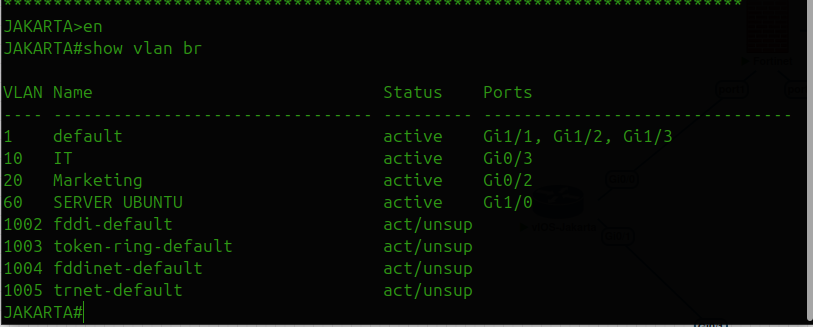
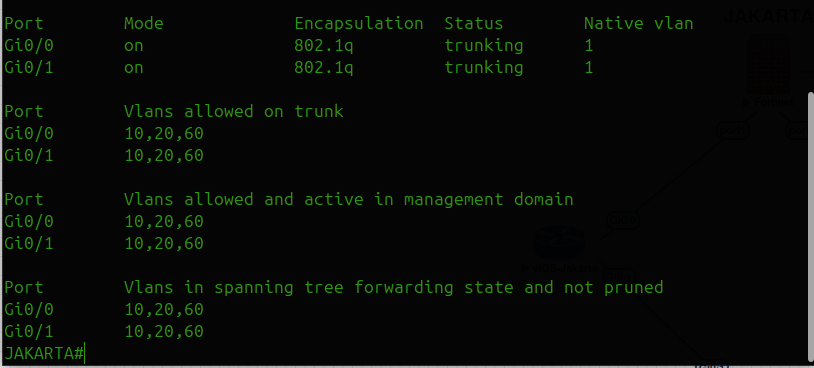
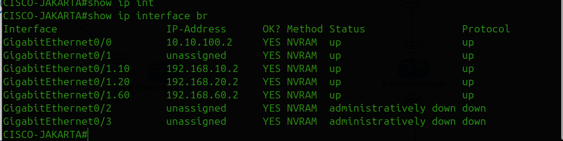
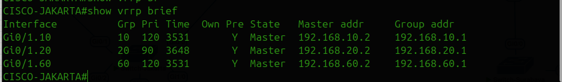
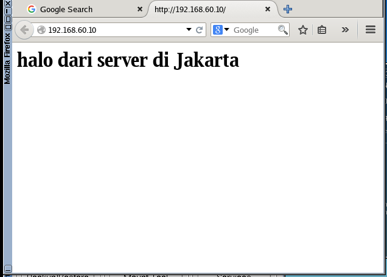

# Daftar Isi
- [Tugas Pendahuluan 1](#tugas-pendahuluan-1)
- [Tugas Pendahuluan 2](#tugas-pendahuluan-2)
- [Dasar Teori](#dasar-teori)
- [Topologi Jaringan](#topologi-jaringan)
- [Praktikum 1 Konfigurasi Cisco Switch](#praktikum-1-konfigurasi-cisco-switch)
- [Praktikum 2 Konfigurasi Cisco Router](#praktikum-2-konfigurasi-cisco-router)
- [Praktikum 3 Konfigurasi Huawei Router dan IP Address Antarrouter](#praktikum-3-konfigurasi-huawei-router-dan-ip-address-antarrouter)
- [Praktikum 4 Konfigurasi OSPF Multivendor dan OSPF Cost](#praktikum-4-konfigurasi-ospf-multivendor-dan-ospf-cost)
- [Praktikum 5 Pengujian Failover OSPF](#praktikum-5-pengujian-failover-ospf)
- [Tugas Modul](#tugas-modul)

---

# Tugas Pendahuluan 1
## 1.1 Topologi Jaringan


| PC  | Switch | VLAN | Nama VLAN | IP Address       |
| --- | ------ | ---: | --------- | ---------------- |
| PC5 | SW1    |   10 | FINANCE   | 192.168.10.10/24 |
| PC3 | SW2    |   10 | FINANCE   | 192.168.10.20/24 |
| PC6 | SW1    |   20 | HR        | 192.168.20.10/24 |
| PC4 | SW2    |   20 | HR        | 192.168.20.20/24 |

## 1.2 Tugas
1. Membuat VLAN 10 dan VLAN 20 pada SW1.
2. Membuat VLAN 10 dan VLAN 20 pada SW2.
3. Mengatur port PC sebagai access port sesuai VLAN masing-masing.
4. Mengatur link antara SW1 dan SW2 sebagai trunk.
5. Mengizinkan VLAN 10 dan VLAN 20 lewat pada trunk.
6. Memberikan IP address pada setiap VPCS.
7. Melakukan pengujian ping.
8. Pc pada vlan 10 bisa saling terhubung.
9. Pc pada vlan 20 bisa saling terhubung. 
10. 

## 1.3 Laporan
1. Screenshot topologi.
2. Screenshot dan jelaskan perintah show vlan brief pada SW1 dan SW2.
3. Screenshot dan jelaskan perintah show interfaces trunk pada SW1 dan SW2.
4. Screenshot IP setiap VPCS.
5. Screenshot ping PC1 ke PC3 berhasil.
6. Screenshot ping PC2 ke PC4 berhasil.
7. Screenshot ping beda VLAN gagal.

# Tugas Pendahuluan 2
1. Buat topologi modul 5 agar waktu praktikum sudah siap tinggal konfigurasi saja (kerjakan secara berkelompok).
2. Pastikan interface link antara perangkat sesuai dengan topologi modul 5.
3. Topologi tidak perlu mirip 100% yang penting adalah link antara perangkat sesuai.


# Dasar Teori
## 1. VLAN (Virtual Local Area Network)
VLAN (Virtual Local Area Network) adalah teknologi jaringan yang memungkinkan pembagian satu jaringan fisik menjadi beberapa jaringan logis yang terpisah. VLAN bekerja dengan cara menandai (tagging) paket data menggunakan VLAN ID, sehingga switch hanya mengirimkan data ke port yang termasuk dalam VLAN yang sama. Dengan demikian, meskipun perangkat terhubung ke switch yang sama secara fisik, mereka dapat diisolasi secara logis untuk meningkatkan keamanan dan efisiensi jaringan.

## 2. Access Port 
Access port adalah jenis port pada switch yang dikonfigurasi untuk menghubungkan perangkat akhir (end-device) seperti PC, printer, atau server ke satu VLAN tertentu saja. Traffic yang melewati access port bersifat untagged, artinya tidak ada label VLAN yang ditambahkan pada frame. Sebagai contoh, port yang dikonfigurasi sebagai access port pada VLAN 10 hanya akan mengirim dan menerima trafik dari VLAN 10.

## 3. Trunk Port
Trunk port adalah jenis port pada switch yang dikonfigurasi untuk membawa traffic dari beberapa VLAN sekaligus melalui satu koneksi fisik. Port ini umumnya digunakan untuk menghubungkan antar-switch atau switch ke router. Traffic yang melewati trunk port bersifat tagged menggunakan protokol IEEE 802.1Q, di mana setiap frame diberi label berisi VLAN ID untuk mengidentifikasi asal VLAN-nya.
## 4. OSPF (Open Shortest Path First)
OSPF adalah protokol routing dinamis berbasis link-state yang digunakan dalam jaringan komputer berbasis IP. OSPF menggunakan algoritma Dijkstra untuk menghitung jalur terpendek (shortest path) antar router berdasarkan nilai cost pada setiap link. Protokol ini termasuk dalam kategori Interior Gateway Protocol (IGP) dan banyak digunakan pada jaringan skala menengah hingga besar seperti jaringan perusahaan dan ISP.

## 5. Cara Kerja OSPF   
OSPF bekerja melalui beberapa tahapan sebagai berikut:

1. **Neighbor Discovery** — Setiap router mengirimkan Hello Packet secara berkala ke router tetangga (neighbour) untuk membangun hubungan adjacency. Hello packet dikirim setiap 10 detik pada media broadcast dan 30 detik pada media point-to-point.

2. **Pertukaran LSA (Link State Advertisement)** — Setiap router membuat Link State Packet (LSP) yang berisi informasi topologi jaringan, kemudian mendistribusikannya ke semua neighbour router.

3. **Pembangunan LSDB (Link State Database)** — Setiap router menyimpan informasi yang diterima ke dalam Link State Database sehingga memiliki gambaran lengkap tentang topologi jaringan.

4. **Perhitungan SPF (Shortest Path First)** — Berdasarkan LSDB, setiap router menjalankan algoritma Dijkstra untuk menghitung jalur terpendek ke setiap tujuan dalam jaringan.

5. **Update Routing Table** — Hasil perhitungan SPF dimasukkan ke dalam tabel routing sebagai jalur terbaik untuk meneruskan paket data.

# Topologi Jaringan

## 1.1 Topologi Jaringan


> [!WARNING]
> **DISCLAIMER:**
> Ada kesalahan pada dua link jalur cisco-huawei di topologi di atas. Seharusnya:
> - `g0/0` terhubung ke `ethernet 1/0/4`
> - `g0/3` terhubung ke `ethernet 1/0/0`

## 1.2 Tabel Addressing Vlan 

| VLAN ID | Nama VLAN | Network         | Gateway      | Keterangan  |
| ------: | --------- | --------------- | ------------ | ----------- |
|      10 | FINANCE   | 192.168.10.0/24 | 192.168.10.1 | DHCP Server |
|      20 | HR        | 192.168.20.0/24 | 192.168.20.1 | DHCP Server |
|      30 | IT        | 192.168.30.0/24 | 192.168.30.1 | Static IP   |
|      40 | MARKETING | 192.168.40.0/24 | 192.168.40.1 | Static IP   |

## 1.3 Tabel Addressing client 

| Perangkat     | VLAN | IP Address       | Gateway      | Keterangan                            |
| ------------- | ---: | ---------------- | ------------ | ------------------------------------- |
| PC Finance    |   10 | DHCP             | 192.168.10.1 | Mendapat IP otomatis dari DHCP Server |
| PC HR         |   20 | DHCP             | 192.168.20.1 | Mendapat IP otomatis dari DHCP Server |
| PC IT         |   30 | 192.168.30.10/24 | 192.168.30.1 | IP static                             |
| PC Marketing  |   40 | 192.168.40.10/24 | 192.168.40.1 | IP static                             |
| PC LAN Huawei |    - | 192.168.50.10/24 | 192.168.50.1 | LAN tambahan pada sisi Huawei         |

## 1.4 Tabel Link Antar Router 

| Link                  | Network       | Perangkat     | Interface     | IP Address    |
| --------------------- | ------------- | ------------- | ------------- | ------------- |
| Cisco ↔ Huawei Link 1 | 10.10.10.0/30 | Cisco Router  | Gi0/3         | 10.10.10.1/30 |
| Cisco ↔ Huawei Link 1 | 10.10.10.0/30 | Huawei Router | Ethernet1/0/0 | 10.10.10.2/30 |
| Cisco ↔ Huawei Link 2 | 10.10.11.0/30 | Cisco Router  | Gi0/0         | 10.10.11.1/30 |
| Cisco ↔ Huawei Link 2 | 10.10.11.0/30 | Huawei Router | Ethernet1/0/4 | 10.10.11.2/30 |
| Cisco ↔ MikroTik      | 10.10.30.0/30 | Cisco Router  | Gi0/1         | 10.10.30.2/30 |
| Cisco ↔ MikroTik      | 10.10.30.0/30 | MikroTik      | ether2        | 10.10.30.1/30 |
| MikroTik ↔ Huawei     | 10.10.20.0/30 | MikroTik      | ether1        | 10.10.20.2/30 |
| MikroTik ↔ Huawei     | 10.10.20.0/30 | Huawei Router | Ethernet1/0/3 | 10.10.20.1/30 |


# Praktikum 1 Konfigurasi Cisco Switch

> [!WARNING]
> **DISCLAIMER:**
> - Harus teliti dalam melakukan konfigurasi.
> - Saat menyalakan router/switch di awal mungkin butuh waktu agak lama.
> - Ketik perintah `do wr` (jika sedang di dalam mode config) atau `wr` (jika di luar mode config) setelah selesai konfigurasi untuk menyimpan pengaturan.
> - Ketika masuk Cicso Switch ada tulisan `would u like to enter the initial configuration dialog [yes/no]?` pilih `no` lalu enter.

## Tujuan
Pada step pertama ini, Cisco Switch akan dikonfigurasi untuk:
1. Membuat VLAN 10, 20, 30, dan 40.
2. Mengatur port menuju PC sebagai access port.
3. Mengatur port menuju Cisco Router sebagai trunk port.
4. Mengatur port menuju Huawei LAN sebagai access port untuk network 192.168.50.0/24.

### 1. Masuk ke terminal Cisco Switch
```
Switch> enable
Switch# configure terminal
Switch(config)#
```
### 2. Membuat Vlan 

```
vlan 10
 name Finance
exit

vlan 20
 name HR
exit

vlan 30
 name IT
exit

vlan 40
 name Marketingg
exit

```
Verifikasi: 
```
show vlan brief

```

### 3. Pastikan vlan sudah dibuat dan statusnya aktif


### 4. Konfigurasi Access port untuk setiap vlan

Port Access harus disesuaikan dengan interface pada cisco switch

```
Switch#conf t

interface gi0/2
 description PC-FINANCE-VLAN10
 switchport mode access
 switchport access vlan 10
 no shutdown
exit

interface gi0/1
 description PC-HR-VLAN20
 switchport mode access
 switchport access vlan 20
 no shutdown
exit

interface gi1/1
 description PC-IT-VLAN30
 switchport mode access
 switchport access vlan 30
 no shutdown
exit

interface gi0/3
 description PC-MARKETING-VLAN40
 switchport mode access
 switchport access vlan 40
 no shutdown
exit

```

### 5. Konfigurasi Trunk ke Cisco Router
Konfigurasi trunk port dari switch menuju cisco router untuk vlan 10, 20, 30, dan 40.

| Interface Switch | Terhubung ke       | Mode  | VLAN yang Dibawa |
| ---------------- | ------------------ | ----- | ---------------- |
| Gi0/0            | Cisco Router Gi0/2 | Trunk | 10,20,30,40      |

Konfigurasi:
```
Switch#conf t

interface gi0/0
 switchport trunk encapsulation dot1q
 description TRUNK-TO-CISCO-ROUTER
 switchport mode trunk
 switchport trunk allowed vlan 10,20,30,40
 no shutdown
exit
```

Verifikasi : 
```
show interfaces trunk   
```


Save semua konfigurasi dengan perintah:
```
write memory
```


### 6. Hasil yang diharapkan
Praktikum 1 selesai jika konfigurasi memenuhi berikut:
1. Vlan 10, 20, 30, dan 40 sudah ada.
2. Trunk port sudah membawa vlan 10, 20, 30, dan 40.
3. Access port setiap vlan sudah sesuai.


# Praktikum 2 Konfigurasi Cisco Router

> [!WARNING]
> **DISCLAIMER:**
> - Harus teliti dalam melakukan konfigurasi.
> - Saat menyalakan router/switch di awal mungkin butuh waktu agak lama.
> - Ketik perintah `do wr` (jika sedang di dalam mode config) atau `wr` (jika di luar mode config) setelah selesai konfigurasi untuk menyimpan pengaturan.
> - Ketika masuk Cicso Router ada tulisan `would u like to enter the initial configuration dialog [yes/no]` pilih `no` lalu enter.

## Tujuan
1. Cisco Router sebagai gateway untuk semua vlan
2. Cisco Router dikonfigurasi dhcp-server.
3. Implementasi ROAS (router-on-a-stick)

### 1. Masuk ke Cisco Router

```
enable
configure terminal
```

### 2. Konfigurasi Inteface Trunk ke Switch
Pilih interface yang terhubung ke Cisco Switch. Pada topologi, interface yang terhubung adalah Gig0/2

```
interface gig0/2
 description TRUNK-TO-CISCO-SWITCH
 no ip address
 no shutdown
 exit
```

### 3. Konfigurasi Subinterface VLAN 10

```
interface gig0/2.10
 description GATEWAY-VLAN10-FINANCE
 encapsulation dot1Q 10
 ip address 192.168.10.1 255.255.255.0
 no shutdown
exit
```

### 4. Konfigurasi Subinterface VLAN 20

```
interface gig0/2.20
 description GATEWAY-VLAN20-HR
 encapsulation dot1Q 20
 ip address 192.168.20.1 255.255.255.0
 no shutdown
 exit
```

### 5. Konfigurasi Subinterface VLAN 30

```
interface gig0/2.30
 description GATEWAY-VLAN30-IT
 encapsulation dot1Q 30
 ip address 192.168.30.1 255.255.255.0
 no shutdown
 exit
```

### 6. Konfigurasi Subinterface VLAN 40

```
interface gig0/2.40
 description GATEWAY-VLAN40-MARKETING
 encapsulation dot1Q 40
 ip address 192.168.40.1 255.255.255.0
 no shutdown
 exit
```

### 7. Konfigurasi DHCP-Server untuk Vlan 10
```
ip dhcp excluded-address 192.168.10.1 192.168.10.10

ip dhcp pool VLAN10-FINANCE
 network 192.168.10.0 255.255.255.0
 default-router 192.168.10.1
 dns-server 8.8.8.8
exit
```

### 8. Konfigurasi DHCP-Server untuk Vlan 20

```
ip dhcp excluded-address 192.168.20.1 192.168.20.10

ip dhcp pool VLAN20-HR
 network 192.168.20.0 255.255.255.0
 default-router 192.168.20.1
 dns-server 8.8.8.8
exit

```

### 9. Konfigurasi IP Static pada VPCS untul vlan 30 dan 40
PC Vlan 30 :
```
ip 192.168.30.10/24 192.168.30.1

```
PC Vlan 40 :
```
ip 192.168.40.10/24 192.168.40.1
```

PC Vlan 10 dan 20 menggunakan dhcp:

```
ip dhcp
```
### 10. Verifikasi Cisco Router
Cek interface:
```
show ip interface brief
```
Pastikan hasil adalah sebagai berikut:


Cek dhcp pool:
```
show ip dhcp pool
```
Pastikan hasil adalah sebagai berikut:


Cek client DHCP yang mendapatkan IP:

```
show ip dhcp binding
```

### 11. Pengujian dari VPCS
Masuk ke pc vlan 10 untuk request ip secara dhcp:
```
ip dhcp
```
Pastikan pc vlan 10 sudah dapat ip secara dhcp dengan command:
```
show ip
```


Dari pc vlan 10 ping gateway 192.168.10.1:
```
ping 192.168.10.1

```


Masuk ke pc vlan 20 untuk request ip secara dhcp:
```
ip dhcp
```
Pastikan pc vlan 20 sudah dapat ip secara dhcp dengan command:
```
show ip
```


Dari pc vlan 20 ping gateway 192.168.20.1:

```
ping 192.168.20.1
```


Dari pc vlan 30 ping gateway 192.168.30.1:
```
ping 192.168.30.1
```


Dari pc vlan 40 ping gateway 192.168.40.1:
```
ping 192.168.40.1

```


Uji ping antar-Vlan dari vlan 10:
```
ping 192.168.20.11
ping 192.168.30.10
ping 192.168.40.10
```


Masuk ke cisco router lagi untuk melihat ip dhcp binding:
```
show ip dhcp binding
```


Amati IP yang diberikan oleh router ke client sesuai dengan ip di pc vlan 10 dan 20. 

### 12. Hasil yang diharapkan
Praktikum 2 berhasil jika memenuhi sebagai berikut:
1. Cisco Router memiliki subinterface VLAN 10, 20, 30, dan 40.
2. VLAN 10 mendapat gateway 192.168.10.1.
3. VLAN 20 mendapat gateway 192.168.20.1.
4. VLAN 30 mendapat gateway 192.168.30.1.
5. VLAN 40 mendapat gateway 192.168.40.1.
6. PC VLAN 10 dan VLAN 20 mendapatkan IP dari DHCP.
7. Semua PC dapat ping gateway masing-masing.
8. PC antar-VLAN dapat saling ping melalui Cisco Router.

# Praktikum 3 Konfigurasi Huawei Router dan IP Address Antarrouter

> [!WARNING]
> **DISCLAIMER:**
> - Config HUAWEI (Praktikum 3): Untuk menghapus ketikan (Backspace), gunakan kombinasi `CTRL + H`.
> - Ketika booting Router Huawei masuk ke `root@debian:/opt/vsrp#` bukan ke `<Huawei>`, matikan Router Huawei, klik kanan pilih wipe, lalu start lagi.
> - Jika konfigurasi sudah di-commit, indikator di terminal akan berubah menjadi `~` (tilde), bukan `*` (yang menandakan masih dalam proses edit/belum disave).

##  Tujuan

Pada praktikum ini, praktikan akan belajar untuk konfigurasi:
1. LAN pada sisi Huawei dengan network 192.168.50.0/24.
2. IP address link Cisco ↔ Huawei.
3. IP address link Huawei ↔ MikroTik.
4. IP address link Cisco ↔ MikroTik.
5. Pengujian konektivitas antarrouter sebelum masuk ke OSPF.

### 1. Konfigurasi Lan Huawei 

konfigurasi ip address untuk lan huawei:

```
system-view

interface Ethernet1/0/2
 description LAN-HUAWEI
 ip address 192.168.50.1 255.255.255.0
 undo shutdown
 quit

commit
```

### 2. Konfigurasi IP VPC Lan Huawei
Pada pc lan huawei:
```
ip 192.168.50.10/24 192.168.50.1
```
Verifikasi:
```
show ip
```


Testing ping gateway huawei:
```
ping 192.168.50.1
```

Pastikan hasilnya reply:


Target: 
PC lan Huawei dapat melakukan ping ke gateway 192.168.50.1

### 3. Konfigurasi IP link cisco <-> Huawei link 1
Network:
```
10.10.10.0/30
```
| Perangkat     | Interface     | IP Address    |
| ------------- | ------------- | ------------- |
| Cisco Router  | Gi0/3         | 10.10.10.1/30 |
| Huawei Router | Ethernet1/0/0 | 10.10.10.2/30 |

**Cisco Router**
```
enable
configure terminal

interface gi0/3
 description LINK1-TO-HUAWEI
 ip address 10.10.10.1 255.255.255.252
 no shutdown
exit
```

**Huawei Router**
```
system-view

interface Ethernet1/0/0
 description LINK1-TO-CISCO
 ip address 10.10.10.2 255.255.255.252
 undo shutdown
 quit

commit

```

### 4. Konfigurasi IP Link Cisco ↔ Huawei Link 2
Network:
```
10.10.11.0/30
```
| Perangkat     | Interface     | IP Address    |
| ------------- | ------------- | ------------- |
| Cisco Router  | Gi0/0         | 10.10.11.1/30 |
| Huawei Router | Ethernet1/0/4 | 10.10.11.2/30 |

**Cisco Router**
```
interface gi0/0
 description LINK2-TO-HUAWEI
 ip address 10.10.11.1 255.255.255.252
 no shutdown
exit
```
**Huawei Router**
```
system-view

interface Ethernet1/0/4
 description LINK2-TO-CISCO
 ip address 10.10.11.2 255.255.255.252
 undo shutdown
 quit

commit
```

### 5. Konfigurasi IP link Huawei <-> Mikrotik
Network:
```
10.10.20.0/30

```
| Perangkat     | Interface     | IP Address    |
| ------------- | ------------- | ------------- |
| Huawei Router | Ethernet1/0/3 | 10.10.20.1/30 |
| MikroTik      | ether1        | 10.10.20.2/30 |

**Huawei Router**
```
system-view

interface Ethernet1/0/3
 description LINK-TO-MIKROTIK
 ip address 10.10.20.1 255.255.255.252
 undo shutdown
 quit

commit
```

**Mikrotik**
```
/ip address add address=10.10.20.2/30 interface=ether1 comment=TO-HUAWEI

```

### 6. Konfigurasi IP link Cisco <-> Mikrotik
Network:
```
10.10.30.0/30
```
| Perangkat    | Interface | IP Address    |
| ------------ | --------- | ------------- |
| Cisco Router | Gi0/1     | 10.10.30.1/30 |
| MikroTik     | ether2    | 10.10.30.2/30 |

**Cisco Router**
```
interface gi0/1
 description LINK-TO-MIKROTIK
 ip address 10.10.30.1 255.255.255.252
 no shutdown
exit
```

**Mikrotik**
```
/ip address add address=10.10.30.2/30 interface=ether2 comment=TO-CISCO
```

### 7. Verifikasi Interface
**Cisco Router**
```
show ip interface brief
```
Pastikan ip pada interface berikut sudah aktif:


**Huawei Router**
```
display ip interface brief
```
Pastikan ip sudah sesuai pada interface dan statusnya up:


**Mikrotik**
```
/ip address print
```
pastikan ip berikut sesuai:


### 8. Verifikasi ping Antar Router
**Dari Cisco Router**
```
ping 10.10.10.2
ping 10.10.11.2
ping 10.10.30.2
```


Target:

Cisco harus bisa ping ke huawei dan mikrotik.

**Dari Router Huawei**
```
ping 10.10.10.1
ping 10.10.11.1
ping 10.10.20.2
```


Target:
Huawei harus bisa ping cisco dan mikrotik.

**Dari Router Mikrotik**
```
ping 10.10.20.1
ping 10.10.30.1
```


Target:
Mikrotik harus bisa ping ke cisco dan huawei.

### 9. Hasil yang diharapkan
1. Praktikum 3 berhasil jika konfigurasi memenuhi berikut ini:
2. LAN Huawei 192.168.50.0/24 aktif.
3. VPC LAN Huawei dapat ping gateway 192.168.50.1.
4. Link Cisco ↔ Huawei pertama aktif.
5. Link Cisco ↔ Huawei kedua aktif.
6. Link Huawei ↔ MikroTik aktif.
7. Link Cisco ↔ MikroTik aktif.
8. Semua router dapat ping ke router tetangga langsung.

#  Praktikum 4 Konfigurasi OSPF Multivendor dan OSPF Cost

> [!WARNING]
> **DISCLAIMER:**
> - Routing Interface Huawei pastikan harus sesuai dengan konfigurasi masing-masing!

## Tujuan
Pada praktikum ini, praktikan mengkonfigurasi routing dinamis menggunakan OSPF pada tiga perangkat berbeda:
1. Cisco Router
2. Huawei Router
3. Mikrotik Router

### 1. Konsep routing ospf pada topologi
Pada topologi ini, cisco router dan huawei memiliki 2 jalur utama. Lalu, mikrotik digunakan sebagai jalur cadangan jika 2 link utama tidak berfungsi. 

| Link                  | Cost | Fungsi       |
| --------------------- | ---: | ------------ |
| Cisco ↔ Huawei Link 1 |   10 | Jalur utama  |
| Cisco ↔ Huawei Link 2 |   10 | Jalur utama  |
| Cisco ↔ MikroTik      |  100 | Jalur backup |
| Huawei ↔ MikroTik     |  100 | Jalur backup |

### 2. Network yang diiklankan ke ospf

**Cisco Router**
| Network         | Keterangan          |
| --------------- | ------------------- |
| 10.10.10.0/30   | Link Cisco-Huawei 1 |
| 10.10.11.0/30   | Link Cisco-Huawei 2 |
| 10.10.30.0/30   | Link Cisco-MikroTik |
| 192.168.10.0/24 | VLAN 10 Finance     |
| 192.168.20.0/24 | VLAN 20 HR          |
| 192.168.30.0/24 | VLAN 30 IT          |
| 192.168.40.0/24 | VLAN 40 Marketing   |

**Huawei Router**
| Network         | Keterangan           |
| --------------- | -------------------- |
| 10.10.10.0/30   | Link Huawei-Cisco 1  |
| 10.10.11.0/30   | Link Huawei-Cisco 2  |
| 10.10.20.0/30   | Link Huawei-MikroTik |
| 192.168.50.0/24 | LAN Huawei           |

**Mikrotik**
| Network       | Keterangan           |
| ------------- | -------------------- |
| 10.10.20.0/30 | Link MikroTik-Huawei |
| 10.10.30.0/30 | Link MikroTik-Cisco  |

### 3. Konfigurasi ospf pada Cisco Router
Masuk ke Cisco Router:
```
enable
configure terminal
```
Konfigurasi OSPF:
```
router ospf 1
 router-id 1.1.1.1
 network 10.10.10.0 0.0.0.3 area 0
 network 10.10.11.0 0.0.0.3 area 0
 network 10.10.30.0 0.0.0.3 area 0
 network 192.168.10.0 0.0.0.255 area 0
 network 192.168.20.0 0.0.0.255 area 0
 network 192.168.30.0 0.0.0.255 area 0
 network 192.168.40.0 0.0.0.255 area 0
exit
```
Atur OSPF cost pada interface Cisco.
```
interface gi0/3
 description LINK1-TO-HUAWEI
 ip ospf cost 10
exit

interface gi0/0
 description LINK2-TO-HUAWEI
 ip ospf cost 10
exit

interface gi0/1
 description LINK-TO-MIKROTIK
 ip ospf cost 100
exit
```

Verifikasi OSPF Cisco:
```
show ip ospf neighbor
show ip route ospf
```
Hasil kemungkinan kosong karena router tetangga masih belum dikonfigurasi
```
show ip protocols

```
Jika ip vlan tidak muncul, simpan konfigurasi cisco router dengan perintah **wr**, lalu ketik perintah **reload**. Tunggu proses restart sampai selesai, lalu cek lagi.

Pastikan network yang akan diiklankan sudah ada:


### 4. Konfigurasi OSPF pada Huawei Router
Masuk ke huawei router:
```
system-view
```
Konfigurasi OSPF:
```
ospf 1 router-id 2.2.2.2
 area 0.0.0.0
  network 10.10.10.0 0.0.0.3
  network 10.10.11.0 0.0.0.3
  network 10.10.20.0 0.0.0.3
  network 192.168.50.0 0.0.0.255
 quit
quit
```
Atur OSPF cost pada interface huawei.
```
interface Ethernet1/0/0
 description LINK1-TO-CISCO
 ospf cost 10
 quit

interface Ethernet1/0/4
 description LINK2-TO-CISCO
 ospf cost 10
 quit

interface Ethernet1/0/3
 description LINK-TO-MIKROTIK
 ospf cost 100
 quit

commit
```
Verifikasi OSPF Huawei:
```
display ospf peer
```


Pastikan huawei peer dengan cisco melalui 2 link utama.

```
display ip routing-table protocol ospf

```
Pastikan hauwei sudah punya mendapatkan network lengkap dari cisco.


```
display ospf routing

```


### 5. Konfigurasi OSPF pada MikroTik
Pada topologi ini, Mikrotik digunakan sebagai jalur backup antara cisco dan huawei.

Network Mikrotik:
| Link              | Interface MikroTik | IP Address    |
| ----------------- | ------------------ | ------------- |
| MikroTik ↔ Huawei | ether1             | 10.10.20.2/30 |
| MikroTik ↔ Cisco  | ether2             | 10.10.30.2/30 |

Masuk ke terminal Mikrotik, lalu konfigurasi router-id OSPF:
```
/routing ospf instance set default router-id=3.3.3.3
```
Tambahkan network OSPF:
```
/routing ospf network add network=10.10.20.0/30 area=backbone
/routing ospf network add network=10.10.30.0/30 area=backbone
```
Atur cost interface mikrotik menjadi jalur bakcup:
```
/routing ospf interface add interface=ether1 cost=100
/routing ospf interface add interface=ether2 cost=100
```

**Verifikasi Mikrotik**
```
/routing ospf neighbor print
```


Pastikan router id cisco dan huawei sudah muncul dimikrotik

Cek routing table OSPF:
```
/ip route print where ospf
```
Hasil yang diharapkan:
```
MikroTik mendapatkan route OSPF menuju VLAN 10, 20, 30, 40 dan LAN Huawei 192.168.50.0/24.

```


### 6. Verifikasi OSPF Neighbor
**Cisco Router**
```
show ip ospf neighbor
```
Hasil yang diharapkan:
```
Neighbor Huawei muncul dua kali.
Neighbor MikroTik muncul satu kali.
```


**Huawei Router**
```
display ospf peer
```
Hasil yang diharapkan:
```
Peer ospf muncul dua kali.
Peer mikrotik muncul satu kali.
```


**Mikrotik**
```
/routing ospf neighbor print
```
Hasil yang diharapkan:
```
Neighbor cisco muncul.
Neigbor Huawei muncul.
```


### 7. Verifikasi Routing Table
**Cisco Router**
Cek route menuju lan huawei:
```
show ip route 192.168.50.0
```
Hasil yang diharapkan pada kondisi normal:
```
Jalur menuju network 192.168.50.0/24 melewati cisco-huawei. Jika dua next-hop muncul, artinya ospf menggunakan dua link utama
```


Cek semua route ospf:
```
show ip route ospf
```
Hasil kemungkinan berbeda dengan modul, yang penting ip antar router sudah ada. Kalo ip antar router sudah ada bisa dilanjutkan. 


**Huawei Router**

Cek semua route ospf:
```
display-ip routing table protocol ospf
```


**Mikrotik**
```
/ip route print where ospf
```
Hasil yang diharapkan:
```
Mikrotik memiliki route ospf ke cisco dan huawei.
```


### 8. Verifikasi Koneksi end-to-end
Lakukan pengujian dari pc vlan menuju lan hauwei.

Dari pc vlan 10:
```
ping 192.168.50.10
```


Dari pc vlan 20:
```
ping 192.168.50.10
```


Dari pc vlan 30:
```
ping 192.168.50.10
```


Dari pc vlan 40:
```
ping 192.168.50.10
```


Lakukan pengujian dari pc lan huawei ke ip vlan cisco:
```
ping 192.168.10.11
ping 192.168.20.11
ping 192.168.30.10
ping 192.168.40.10

```


### 9. Hasil yang diharapkan
Praktikum 4 berhasil jika:
1. Cisco Router membentuk OSPF neighbor dengan Huawei dan MikroTik.
2. Huawei Router membentuk OSPF peer dengan Cisco dan MikroTik.
3. MikroTik membentuk OSPF neighbor dengan Cisco dan Huawei.
4. Cisco mendapatkan route OSPF menuju LAN Huawei 192.168.50.0/24.
5. Huawei mendapatkan route OSPF menuju VLAN 10, 20, 30, dan 40.
6. MikroTik mendapatkan route OSPF menuju semua network.
7. PC VLAN 10, 20, 30, dan 40 dapat ping PC LAN Huawei.
8. PC LAN Huawei dapat ping ke network VLAN Cisco.


# Praktikum 5 Pengujian Failover OSPF

### 1. Kondisi normal: Dua link cisco-huawei aktif

Cek route dari cisco menuju lan huawei:
```
show ip route 192.168.50.0
```
Lakukan trace dari pc vlan menuju lan huawei:
```
trace 192.168.50.10
```

Hasil yang diharapkan:
```
Traffic melewati jalur langsung Cisco → Huawei.
```


### 2. Kondisi 1 link cisco-huawei mati

Matikan salah satu link cisco-huawei.
```
configure terminal
interface gi0/3
 shutdown
exit

```
Cek route dari cisco menuju lan huawei:
```
show ip route 192.168.50.0
```

Lakukan trace dari pc vlan menuju lan huawei:
```
trace 192.168.50.10
```

Hasil yang diharapkan:
```
Traffic tetap melewati jalur langsung Cisco
```


### 3. Kondisi dua link cisco-huawei mati
Matikan link cisco-huawei yang kedua:
```
configure terminal
interface gi0/0
 shutdown
exit

```
Cek route dari cisco menuju lan huawei:
```
show ip route 192.168.50.0
```
Lakukan trace dari pc vlan menuju lan huawei:
```
trace 192.168.50.10
```

Hasil yang diharapkan:
```
Route berpindah ke jalur backup melalui MikroTik.

Jalur:
PC VLAN → Cisco Router → MikroTik → Huawei Router → LAN Huawei
```


### 4. Mengaktifkan kembali dua link cisco huawei
```
configure terminal
interface gi0/3
 no shutdown
exit

interface gi0/0
 no shutdown
exit
```
Cek route dari cisco menuju lan huawei:
```
show ip route 192.168.50.0
```
Lakukan trace dari pc vlan menuju lan huawei:
```
trace 192.168.50.10
```
Hasil yang diharapkan:
```
Jalur routing kembali pindah ke link utama cisco-huawei.
```


### 5. Bukti yang dikumpulkan
1. Screenshot trace 192.168.50.10 saat dua link aktif.
2. Screenshot trace 192.168.50.10 saat satu link mati.
3. Screenshot trace 192.168.50.10 yang menunjukkan jalur melewati MikroTik.


# Tugas Modul

## Implementasi Jaringan Enterprise HQ–Branch dengan VRRP, ISC-DHCP, FortiGate, GRE Tunnel, dan OSPF
## Topologi Jaringan

## Ketentuan Pengerjaan
1. Dikerjakan secara berkelompok kayak tugas modul 4 kemarin.
2. Dikumpulkan seperti tugas modul 4.
3. Laporan juga sama kayak tugas modul 4.
4. Jangan deadliner. Bisa dicicil satu hari 1 router atau perangkat.
5. Hasil screeshotku bisa saja berbeda dengan kalian, jadi sesuaikan dengan kalian saja. 
6. Minta tutor ke teman yang jago.
7. Tanyakan di grup kalo ada yang kurang jelas.
8. Teliti saat konfigurasi di Fortigate
9. MALU BERTANYA SESAN DI JALAN.
## 1. Deskripsi Singkat

Topologi di atas adalah simulasi jaringan enterprise menghubungkan 2 kantor pusat dan kantor cabang. Kantor pusat ada di Jakarta dan kantor cabang ada di Surabaya. 2 Kantor tersebut akan dihubungkan menggunakn teknologi Gre Tunel agar bisa saling berkomunikasi meskipun tidak dalam satu kantor.

Topologi ini menggunakan beberapa perangkat virtual, antara lain Cisco Vios, Cisco Switch, Mikrok RouterOs, Fortinet, Ubuntu Server, Tinycore Linux, dan Vpcs. Setiap perangkat memiliki fungsi masing-masing.

## Tabel Addressing

Bagian ini menjelaskan pembagian alamat IP yang digunakan pada topologi jaringan Enterprise HQ–Branch. Addressing dibagi menjadi tiga bagian utama, yaitu sisi **Jakarta/HQ**, sisi **ISP**, dan sisi **Surabaya/Branch**.

---

# 2. Addressing Jakarta / HQ

## 2.1 VLAN Jakarta

| VLAN | Nama VLAN | Network         | Gateway Virtual | Keterangan                      |
| ---: | --------- | --------------- | --------------- | ------------------------------- |
|   10 | FINANCE   | 192.168.10.0/24 | 192.168.10.1    | DHCP dari Ubuntu Server Jakarta |
|   20 | IT        | 192.168.20.0/24 | 192.168.20.1    | DHCP dari Ubuntu Server Jakarta |
|   60 | SERVER-HQ | 192.168.60.0/24 | 192.168.60.1    | VLAN server Ubuntu Jakarta      |

---

## 2.2 IP Address Cisco Router Jakarta

| Interface |               VLAN / Link | IP Address      | Keterangan                                 |
| --------- | ------------------------: | --------------- | ------------------------------------------ |
| Gi0/1.10  |                   VLAN 10 | 192.168.10.2/24 | IP fisik Cisco untuk VLAN 10               |
| Gi0/1.20  |                   VLAN 20 | 192.168.20.2/24 | IP fisik Cisco untuk VLAN 20               |
| Gi0/1.60  |                   VLAN 60 | 192.168.60.2/24 | IP fisik Cisco untuk VLAN 60               |
| Gi0/0     | Link ke FortiGate Jakarta | 10.10.100.2/30  | Transit Cisco Jakarta ke FortiGate Jakarta |

---

## 2.3 IP Address MikroTik Router Jakarta

| Interface      |               VLAN / Link | IP Address      | Keterangan                                    |
| -------------- | ------------------------: | --------------- | --------------------------------------------- |
| vlan10-finance |                   VLAN 10 | 192.168.10.3/24 | IP fisik MikroTik untuk VLAN 10               |
| vlan20-it      |                   VLAN 20 | 192.168.20.3/24 | IP fisik MikroTik untuk VLAN 20               |
| vlan60-server  |                   VLAN 60 | 192.168.60.3/24 | IP fisik MikroTik untuk VLAN 60               |
| ether1         | Link ke FortiGate Jakarta | 10.10.101.2/30  | Transit MikroTik Jakarta ke FortiGate Jakarta |

---

## 2.4 VRRP Jakarta

| VLAN | Virtual IP   | Master                  | Backup                  | Keterangan              |
| ---: | ------------ | ----------------------- | ----------------------- | ----------------------- |
|   10 | 192.168.10.1 | Cisco Router Jakarta    | MikroTik Router Jakarta | Gateway virtual VLAN 10 |
|   20 | 192.168.20.1 | MikroTik Router Jakarta | Cisco Router Jakarta    | Gateway virtual VLAN 20 |
|   60 | 192.168.60.1 | Cisco Router Jakarta    | MikroTik Router Jakarta | Gateway virtual VLAN 60 |

---

## 2.5 Ubuntu Server Jakarta

| Perangkat             | VLAN | IP Address       | Gateway      | Service                              |
| --------------------- | ---: | ---------------- | ------------ | ------------------------------------ |
| Ubuntu Server Jakarta |   60 | 192.168.60.10/24 | 192.168.60.1 | ISC-DHCP Server dan Nginx Web Server |

---

## 2.6 DHCP Pool Jakarta

| VLAN | Network         | Range DHCP                      | Gateway yang Diberikan | DHCP Server           |
| ---: | --------------- | ------------------------------- | ---------------------- | --------------------- |
|   10 | 192.168.10.0/24 | 192.168.10.100 - 192.168.10.200 | 192.168.10.1           | Ubuntu Server Jakarta |
|   20 | 192.168.20.0/24 | 192.168.20.100 - 192.168.20.200 | 192.168.20.1           | Ubuntu Server Jakarta |

---

## 2.7 FortiGate Jakarta

| Interface   | Terhubung ke            | IP Address     | Keterangan               |
| ----------- | ----------------------- | -------------- | ------------------------ |
| port1       | Cisco Router Jakarta    | 10.10.100.1/30 | Link ke Cisco Jakarta    |
| port2       | MikroTik Router Jakarta | 10.10.101.1/30 | Link ke MikroTik Jakarta |
| port3       | MikroTik ISP            | 10.0.12.2/30   | Link WAN ke ISP          |
| GRE-JKT-SBY | FortiGate Surabaya      | 172.16.0.1/32  | IP GRE Tunnel Jakarta    |

---

# 3. Addressing ISP

## 3.1 MikroTik ISP

| Interface | Terhubung ke         | IP Address            | Keterangan              |
| --------- | -------------------- | --------------------- | ----------------------- |
| ether2    | FortiGate Jakarta    | 10.0.12.1/30          | Link ISP ke Jakarta     |
| ether3    | FortiGate Surabaya   | 10.0.13.1/30          | Link ISP ke Surabaya    |
| ether1    | Cloud NAT / Internet | DHCP / sesuai PNETLab | Akses internet simulasi |

---

## 3.2 Link WAN ISP

| Link           | Network      | Sisi A       | IP Sisi A | Sisi B             | IP Sisi B |
| -------------- | ------------ | ------------ | --------- | ------------------ | --------- |
| Jakarta ↔ ISP  | 10.0.12.0/30 | MikroTik ISP | 10.0.12.1 | FortiGate Jakarta  | 10.0.12.2 |
| ISP ↔ Surabaya | 10.0.13.0/30 | MikroTik ISP | 10.0.13.1 | FortiGate Surabaya | 10.0.13.2 |

---

# 3. Addressing Surabaya / Branch

## 4.1 VLAN Surabaya

| VLAN | Nama VLAN  | Network         | Gateway      | Keterangan                  |
| ---: | ---------- | --------------- | ------------ | --------------------------- |
|   30 | SALES      | 192.168.30.0/24 | 192.168.30.1 | DHCP dari MikroTik Surabaya |
|   40 | OPERATIONS | 192.168.40.0/24 | 192.168.40.1 | IP static manual            |

---

## 4.2 IP Address MikroTik Router Surabaya

| Interface         |                VLAN / Link | IP Address      | Keterangan                                      |
| ----------------- | -------------------------: | --------------- | ----------------------------------------------- |
| vlan30-sales      |                    VLAN 30 | 192.168.30.1/24 | Gateway VLAN 30                                 |
| vlan40-operations |                    VLAN 40 | 192.168.40.1/24 | Gateway VLAN 40                                 |
| ether1            | Link ke FortiGate Surabaya | 10.10.200.2/30  | Transit MikroTik Surabaya ke FortiGate Surabaya |

---

## 4.3 DHCP Pool Surabaya

| VLAN | Network         | Range DHCP                      | Gateway yang Diberikan | DHCP Server            |
| ---: | --------------- | ------------------------------- | ---------------------- | ---------------------- |
|   30 | 192.168.30.0/24 | 192.168.30.100 - 192.168.30.200 | 192.168.30.1           | MikroTik Surabaya      |
|   40 | 192.168.40.0/24 | Static manual                   | 192.168.40.1           | Tidak menggunakan DHCP |

---

## 4.4 IP Client Surabaya

| Client        | VLAN | IP Address       | Gateway      | Keterangan                         |
| ------------- | ---: | ---------------- | ------------ | ---------------------------------- |
| PC Sales      |   30 | DHCP             | 192.168.30.1 | Mendapat IP dari MikroTik Surabaya |
| PC Operations |   40 | 192.168.40.10/24 | 192.168.40.1 | IP static manual                   |
| PC Operations Tinycore linux |   40 | 192.168.40.20/24 | 192.168.40.1 | IP static manual                   |

---

## 4.5 FortiGate Surabaya

| Interface   | Terhubung ke      | IP Address     | Keterangan                         |
| ----------- | ----------------- | -------------- | ---------------------------------- |
| port1       | MikroTik ISP      | 10.0.13.2/30   | Link WAN ke ISP                    |
| port2       | MikroTik Surabaya | 10.10.200.1/30 | Link ke jaringan internal Surabaya |
| GRE-SBY-JKT | FortiGate Jakarta | 172.16.0.2/32  | IP GRE Tunnel Surabaya             |

---

# 5. GRE Tunnel Jakarta–Surabaya

| Tunnel      | Perangkat          | Local WAN | Remote WAN | Tunnel IP     |
| ----------- | ------------------ | --------- | ---------- | ------------- |
| GRE-JKT-SBY | FortiGate Jakarta  | 10.0.12.2 | 10.0.13.2  | 172.16.0.1/32 |
| GRE-SBY-JKT | FortiGate Surabaya | 10.0.13.2 | 10.0.12.2  | 172.16.0.2/32 |

GRE Tunnel digunakan sebagai jalur virtual antara FortiGate Jakarta dan FortiGate Surabaya. OSPF dijalankan di atas GRE Tunnel agar route jaringan Jakarta dan Surabaya dapat saling dipertukarkan secara dinamis.

---

# 6. Network yang Diiklankan melalui OSPF

## 6.1 Network Jakarta

| Network         | Keterangan              |
| --------------- | ----------------------- |
| 192.168.10.0/24 | VLAN 10 Finance Jakarta |
| 192.168.20.0/24 | VLAN 20 IT Jakarta      |
| 192.168.60.0/24 | VLAN Server Jakarta     |
| 172.16.0.1/32   | GRE Tunnel Jakarta      |

---

## 6.2 Network Surabaya

| Network         | Keterangan                  |
| --------------- | --------------------------- |
| 192.168.30.0/24 | VLAN 30 Sales Surabaya      |
| 192.168.40.0/24 | VLAN 40 Operations Surabaya |
| 172.16.0.2/32   | GRE Tunnel Surabaya         |

---

# 7. Ringkasan Jalur Traffic

## 7.1 Client Jakarta ke Internet

```text
Client Jakarta
→ VRRP Gateway Cisco/MikroTik Jakarta
→ FortiGate Jakarta
→ MikroTik ISP
→ Cloud NAT / Internet
```

## 7.2 Client Surabaya ke Internet

```text
Client Surabaya
→ MikroTik Surabaya
→ FortiGate Surabaya
→ MikroTik ISP
→ Cloud NAT / Internet
```

## 7.3 Client Surabaya ke Web Server Jakarta

```text
Client Surabaya
→ MikroTik Surabaya
→ FortiGate Surabaya
→ GRE Tunnel
→ FortiGate Jakarta
→ Cisco/MikroTik Jakarta
→ Ubuntu Server Jakarta
```

## 7.4 Client Jakarta ke Client Surabaya

```text
Client Jakarta
→ VRRP Gateway Jakarta
→ FortiGate Jakarta
→ GRE Tunnel
→ FortiGate Surabaya
→ MikroTik Surabaya
→ Client Surabaya
```


## 2. Tujuan Tugas

Setelah menyelesaikan tugas ini, praktikan diharapkan mampu:

1. Mengkonfigurasi VLAN dan trunk pada Cisco Switch.
2. Mengkonfigurasi VRRP antara Cisco Router dan MikroTik Router.
3. Mengkonfigurasi DHCP Server terpusat menggunakan Ubuntu Server dan ISC-DHCP.
4. Mengkonfigurasi DHCP Relay pada router.
5. Mengkonfigurasi FortiGate sebagai firewall dan NAT gateway.
6. Mengkonfigurasi MikroTik ISP sebagai simulasi jaringan provider.
7. Mengkonfigurasi jaringan Branch Surabaya menggunakan FortiGate dan MikroTik.
8. Mengkonfigurasi GRE Tunnel antar-FortiGate.
9. Mengkonfigurasi OSPF over GRE dengan redistribute static route.
10. Menguji konektivitas antar-site menggunakan ping dan akses web server.

## 3. Gambaran Topologi

Topologi terdiri dari tiga bagian utama:

### 3.1 HQ Jakarta

Sisi Jakarta terdiri dari:

* Cisco Switch Jakarta
* Cisco Router Jakarta
* MikroTik Router Jakarta
* Ubuntu Server Jakarta
* FortiGate Jakarta
* Client VLAN 10 dan VLAN 20

Cisco Router Jakarta dan MikroTik Router Jakarta digunakan sebagai dual gateway menggunakan VRRP. Ubuntu Server Jakarta digunakan sebagai DHCP Server terpusat untuk VLAN 10 dan VLAN 20. FortiGate Jakarta digunakan sebagai edge firewall, NAT gateway, dan GRE endpoint menuju Surabaya.

### 3.2 ISP

Sisi ISP disimulasikan menggunakan MikroTik RouterOS. MikroTik ISP menghubungkan FortiGate Jakarta dan FortiGate Surabaya. MikroTik ISP juga dapat dikonfigurasi NAT ke Cloud PNETLab agar perangkat internal dapat mengakses internet.

### 3.3 Branch Surabaya

Sisi Surabaya terdiri dari:

* FortiGate Surabaya
* MikroTik Router Surabaya
* Cisco Switch Surabaya
* Client VLAN 30 dan VLAN 40

FortiGate Surabaya digunakan sebagai edge firewall dan GRE endpoint. MikroTik Surabaya digunakan sebagai gateway VLAN 30 dan VLAN 40. VLAN 30 menggunakan DHCP Server dari MikroTik, sedangkan VLAN 40 menggunakan IP static.

## 4. Pembagian Tugas Modul

Tugas dibagi menjadi beberapa bagian agar praktikan dapat mengerjakan konfigurasi secara bertahap.

---

# Tugas Modul 1 — Konfigurasi Cisco Switch Jakarta

## Perangkat yang Dikonfigurasi

Cisco Switch Jakarta.

## Hal yang Harus Dikonfigurasi

1. Membuat VLAN 10, VLAN 20, dan VLAN 60.
2. Mengatur port ke client VLAN 10 sebagai access VLAN 10.
3. Mengatur port ke client VLAN 20 sebagai access VLAN 20.
4. Mengatur port ke Ubuntu Server sebagai access VLAN 60.
5. Mengatur link ke Cisco Router Jakarta sebagai trunk.
6. Mengatur link ke MikroTik Router Jakarta sebagai trunk.
7. Memastikan trunk membawa VLAN 10, 20, dan 60.

## Hasil yang Diharapkan

1. VLAN 10, 20, dan 60 berhasil dibuat.
2. Client VLAN 10 berada pada VLAN 10.
3. Client VLAN 20 berada pada VLAN 20.
4. Ubuntu Server berada pada VLAN 60.
5. Link ke Cisco Router dan MikroTik Router aktif sebagai trunk.
6. VLAN 10, 20, dan 60 dapat melewati trunk.

## Bukti yang Dikumpulkan

1. Screenshot topologi Jakarta.

2. Screenshot `show vlan brief`.



3. Screenshot `show interfaces trunk`.



---

# Tugas Modul 2 — Konfigurasi Cisco Router Jakarta

## Perangkat yang Dikonfigurasi

Cisco Router Jakarta.

## Hal yang Harus Dikonfigurasi

1. Membuat subinterface untuk VLAN 10, VLAN 20, dan VLAN 60.
2. Memberikan IP fisik pada setiap subinterface.
3. Mengkonfigurasi VRRP untuk VLAN 10, 20, dan 60.
4. Mengatur Cisco sebagai VRRP master untuk VLAN 10 dan 60.
5. Mengkonfigurasi DHCP Relay menuju Ubuntu Server Jakarta.
6. Mengkonfigurasi link dari Cisco Router Jakarta ke FortiGate Jakarta.
7. Menambahkan route/default route menuju FortiGate Jakarta.

## Hasil yang Diharapkan

1. Cisco Router memiliki subinterface VLAN 10, 20, dan 60.
2. Cisco Router ikut menjalankan VRRP.
3. Cisco Router dapat menjadi gateway aktif untuk VLAN tertentu.
4. Cisco Router dapat meneruskan DHCP request ke Ubuntu Server.
5. Cisco Router dapat terhubung ke FortiGate Jakarta.

## Bukti yang Dikumpulkan

1. Screenshot `show ip interface brief`.



2. Screenshot `show vrrp brief`.



3. Screenshot konfigurasi subinterface.

4. Screenshot ping dari Cisco Router ke FortiGate Jakarta.
```
CISCO-JAKARTA#ping 10.10.100.1
Type escape sequence to abort.
Sending 5, 100-byte ICMP Echos to 10.10.100.1, timeout is 2 seconds:
!!!!!
Success rate is 100 percent (5/5), round-trip min/avg/max = 1/1/2 ms
CISCO-JAKARTA#

```

---

# Tugas Modul 3 — Konfigurasi MikroTik Router Jakarta

## Perangkat yang Dikonfigurasi

MikroTik Router Jakarta.

## Hal yang Harus Dikonfigurasi

1. Membuat VLAN interface untuk VLAN 10, VLAN 20, dan VLAN 60.
2. Memberikan IP fisik pada setiap VLAN interface.
3. Mengkonfigurasi VRRP untuk VLAN 10, VLAN 20, dan VLAN 60.
4. Mengatur MikroTik sebagai VRRP master untuk VLAN 20.
5. Mengkonfigurasi DHCP Relay menuju Ubuntu Server Jakarta.
6. Mengkonfigurasi link dari MikroTik Jakarta ke FortiGate Jakarta.
7. Menambahkan default route menuju FortiGate Jakarta.

## Hasil yang Diharapkan

1. MikroTik Router memiliki VLAN interface untuk VLAN 10, 20, dan 60.
2. MikroTik ikut menjalankan VRRP bersama Cisco Router.
3. MikroTik dapat menjadi gateway aktif untuk VLAN 10,20, dan 60.
4. MikroTik dapat meneruskan DHCP request ke Ubuntu Server.
5. MikroTik dapat terhubung ke FortiGate Jakarta.

## Bukti yang Dikumpulkan

1. Screenshot `/ip address print`.
```
[admin@Mikrotik-Jakarta] > ip address print
Flags: X - disabled, I - invalid, D - dynamic 
 #   ADDRESS            NETWORK         INTERFACE                                     
 0   192.168.10.3/24    192.168.10.0    vlan10-finance                                
 1   192.168.20.3/24    192.168.20.0    vlan20-it                                     
 2   192.168.60.3/24    192.168.60.0    vlan60-ubuntu-server                          
 3   ;;; TO-FORTINET
     10.10.101.2/30     10.10.101.0     ether1                                        
 4   192.168.20.1/32    192.168.20.1    vrrp20                                        
 5   192.168.10.1/32    192.168.10.1    vrrp10                                        
 6   192.168.60.1/32    192.168.60.1    vrrp60                                        
[admin@Mikrotik-Jakarta] > 

```
2. Screenshot `/interface vrrp print`.
```
[admin@Mikrotik-Jakarta] > interface vrrp print
Flags: X - disabled, I - invalid, R - running, M - master, B - backup 
 #     NAME         INTERFACE    MAC-ADDRESS       VRI PRI INTERVAL             V V3..
 0  RM vrrp10       vlan10-fi... 00:00:5E:00:01:0A  10  90 1s                   3 ipv4
 1  RM vrrp20       vlan20-it    00:00:5E:00:01:14  20 120 1s                   3 ipv4
 2  RM vrrp60       vlan60-ub... 00:00:5E:00:01:3C  60  90 1s                   3 ipv4
[admin@Mikrotik-Jakarta] > 

```
3. Screenshot `/ip dhcp-relay print`.
```
[admin@Mikrotik-Jakarta] > ip dhcp-relay print
Flags: X - disabled, I - invalid 
 #   NAME                   INTERFACE                  DHCP-SERVER     LOCAL-ADDRESS  
 0   relay-vlan10           vlan10-finance             192.168.60.10   192.168.10.3   
 1   relay-vlan20           vlan20-it                  192.168.60.10   192.168.20.3   
[admin@Mikrotik-Jakarta] > 

```
4. Screenshot `/ip route print`.
```
[admin@Mikrotik-Jakarta] > ip route print
Flags: X - disabled, A - active, D - dynamic, 
C - connect, S - static, r - rip, b - bgp, o - ospf, m - mme, 
B - blackhole, U - unreachable, P - prohibit 
 #      DST-ADDRESS        PREF-SRC        GATEWAY            DISTANCE
 0 A S  0.0.0.0/0                          10.10.101.1               1
 1 ADC  10.10.101.0/30     10.10.101.2     ether1                    0
 2 ADC  192.168.10.0/24    192.168.10.3    vlan10-finance            0
 3 ADC  192.168.10.1/32    192.168.10.1    vrrp10                    0
 4 ADC  192.168.20.0/24    192.168.20.3    vlan20-it                 0
 5 ADC  192.168.20.1/32    192.168.20.1    vrrp20                    0
 6 ADC  192.168.60.0/24    192.168.60.3    vlan60-ubuntu-s...        0
 7 ADC  192.168.60.1/32    192.168.60.1    vrrp60                    0
[admin@Mikrotik-Jakarta] > 

```
5. Screenshot ping dari MikroTik ke FortiGate Jakarta.
```
[admin@Mikrotik-Jakarta] > ping 10.10.101.1
  SEQ HOST                                     SIZE TTL TIME  STATUS                  
    0 10.10.101.1                                56 255 1ms  
    1 10.10.101.1                                56 255 0ms  
    2 10.10.101.1                                56 255 0ms  
    3 10.10.101.1                                56 255 0ms  
    4 10.10.101.1                                56 255 0ms  
    sent=5 received=5 packet-loss=0% min-rtt=0ms avg-rtt=0ms max-rtt=1ms 

[admin@Mikrotik-Jakarta] > 

```

---

# Tugas Modul 4 — Konfigurasi Ubuntu Server Jakarta

## Perangkat yang Dikonfigurasi

Ubuntu Server Jakarta.
## Troubleshooting
1. Sebelum menghubungkan Ubuntu ke Cisco Switch, hubungkan dulu ke network >  **network management**.
2. Setelah terhubung ke network/cloud dan mendapatkan ip secara dhcp, install semua yang dibutuhkan, yaitu isc-dhcp-server, dan Nginx.
3. Setelah install isc-dhcp-server dan Nginx selesai, baru hubungkan ke Cisco Switch vlan 60 dan konfigurasi static IP.
## Hal yang Harus Dikonfigurasi

1. Mengkonfigurasi IP static Ubuntu Server pada VLAN 60.
2. Mengatur default gateway Ubuntu ke VRRP virtual IP VLAN 60.
3. Menginstall ISC-DHCP Server.
4. Membuat DHCP pool untuk VLAN 10 dan VLAN 20.
5. Memastikan gateway DHCP yang diberikan adalah IP virtual VRRP.
6. Menginstall Nginx sebagai web server Jakarta.
7. Mengubah halaman web menjadi tulisan identitas server Jakarta.

## Hasil yang Diharapkan

1. Ubuntu Server dapat mengakses internet.
2. ISC-DHCP Server berjalan dengan normal.
3. Client VLAN 10 mendapat IP DHCP dari Ubuntu Server.
4. Client VLAN 20 mendapat IP DHCP dari Ubuntu Server.
5. Web server Nginx dapat diakses dari jaringan Jakarta dan Surabaya.

## Bukti yang Dikumpulkan

1. Screenshot `ip a`.
```
2: eth0: <BROADCAST,MULTICAST,UP,LOWER_UP> mtu 1500 qdisc fq_codel state UP group default qlen 1000
    link/ether 50:8c:e5:00:ef:00 brd ff:ff:ff:ff:ff:ff
    inet 192.168.60.10/24 brd 192.168.60.255 scope global eth0
       valid_lft forever preferred_lft forever
    inet6 fe80::528c:e5ff:fe00:ef00/64 scope link 
       valid_lft forever preferred_lft forever
root@kvm:/# 

```
2. Screenshot `ip route`.
```
root@kvm:/# ip route
default via 192.168.60.1 dev eth0 proto static 
192.168.60.0/24 dev eth0 proto kernel scope link src 192.168.60.10 
root@kvm:/# 

```
3. Screenshot isi file `/etc/dhcp/dhcpd.conf`.
```
root@kvm:/# sudo cat /etc/dhcp/dhcpd.conf
authoritative;

default-lease-time 600;
max-lease-time 7200;

# DNS
option domain-name-servers 8.8.8.8, 1.1.1.1;

# VLAN 10 - Finance
subnet 192.168.10.0 netmask 255.255.255.0 {
  range 192.168.10.100 192.168.10.200;
  option routers 192.168.10.1;
  option subnet-mask 255.255.255.0;
  option broadcast-address 192.168.10.255;
}

# VLAN 20 - IT
subnet 192.168.20.0 netmask 255.255.255.0 {
  range 192.168.20.100 192.168.20.200;
  option routers 192.168.20.1;
  option subnet-mask 255.255.255.0;
  option broadcast-address 192.168.20.255;
}

# VLAN 60 - Server Network
subnet 192.168.60.0 netmask 255.255.255.0 {
  option routers 192.168.60.1;
  option subnet-mask 255.255.255.0;
  option broadcast-address 192.168.60.255;
}
root@kvm:/# 

```
4. Sreenshot `ping 8.8.8.8`
```
root@kvm:/# ping 8.8.8.8
PING 8.8.8.8 (8.8.8.8) 56(84) bytes of data.
64 bytes from 8.8.8.8: icmp_seq=3 ttl=109 time=25.7 ms
64 bytes from 8.8.8.8: icmp_seq=4 ttl=109 time=24.0 ms
^C
--- 8.8.8.8 ping statistics ---
10 packets transmitted, 2 received, 80% packet loss, time 9132ms
rtt min/avg/max/mdev = 24.003/24.871/25.740/0.868 ms
root@kvm:/# 
```
---

# Tugas Modul 5 — Konfigurasi FortiGate Jakarta

## Perangkat yang Dikonfigurasi

FortiGate Jakarta.

## Hal yang Harus Dikonfigurasi

1. Mengkonfigurasi interface ke Cisco Router Jakarta.
2. Mengkonfigurasi interface ke MikroTik Router Jakarta.
3. Mengkonfigurasi interface ke MikroTik ISP.
4. Menambahkan default route menuju MikroTik ISP.
5. Menambahkan static route menuju network internal Jakarta.
6. Membuat firewall policy dari jaringan Jakarta ke internet.
7. Mengaktifkan NAT untuk traffic internet.
8. Mengkonfigurasi GRE Tunnel menuju FortiGate Surabaya.
9. Mengkonfigurasi OSPF over GRE.
10. Mengaktifkan redistribute static route ke OSPF.

## Hasil yang Diharapkan

1. FortiGate Jakarta dapat ping MikroTik ISP.
2. FortiGate Jakarta dapat ping 8.8.8.8.
3. Client Jakarta dapat akses internet.
4. GRE Tunnel ke Surabaya aktif.
5. OSPF neighbor dengan FortiGate Surabaya berstatus Full.
6. Route Surabaya muncul di routing table FortiGate Jakarta.

## Bukti yang Dikumpulkan

1. Screenshot `get system interface physical`.
```
Fortinet-Jakarta # get system interface physical 
== [onboard]
	==[port1]
		mode: static
		ip: 10.10.100.1 255.255.255.252
		ipv6: ::/0
		status: up
		speed: 10000Mbps (Duplex: full)
		FEC: none
		FEC_cap: none
	==[port2]
		mode: static
		ip: 10.10.101.1 255.255.255.252
		ipv6: ::/0
		status: up
		speed: 10000Mbps (Duplex: full)
		FEC: none
		FEC_cap: none
	==[port3]
		mode: static
		ip: 10.0.12.2 255.255.255.252
		ipv6: ::/0
		status: up
		speed: 10000Mbps (Duplex: full)
		FEC: none
                FEC_cap: none

```
2. Screenshot `get router info routing-table all`.
3. Screenshot firewall policy.
4. Screenshot ping ke 8.8.8.8.
5. Screenshot ping ke IP tunnel Surabaya.
6. Screenshot `get router info ospf neighbor`.
7. Screenshot `get router info routing-table ospf`.

---

# Tugas Modul 6 — Konfigurasi MikroTik ISP

## Perangkat yang Dikonfigurasi

MikroTik ISP.

## Hal yang Harus Dikonfigurasi

1. Mengkonfigurasi IP link ke FortiGate Jakarta.
2. Mengkonfigurasi IP link ke FortiGate Surabaya.
3. Mengkonfigurasi koneksi ke Cloud NAT PNETLab.
4. Menambahkan default route menuju Cloud NAT.
5. Mengkonfigurasi NAT masquerade agar perangkat lab dapat mengakses internet.
6. Memastikan FortiGate Jakarta dan FortiGate Surabaya saling reachable melalui ISP.

## Hasil yang Diharapkan

1. MikroTik ISP dapat ping 8.8.8.8.
2. FortiGate Jakarta dapat ping FortiGate Surabaya melalui IP WAN.
3. FortiGate Surabaya dapat ping FortiGate Jakarta melalui IP WAN.
4. ISP tidak menjalankan OSPF enterprise.

## Bukti yang Dikumpulkan

1. Screenshot `/ip address print` **hasil di ether 1 bisa saja berbeda karena emang dinamic**.
```
[admin@mikrotik-isp] > ip address print
Flags: X - disabled, I - invalid, D - dynamic 
 #   ADDRESS            NETWORK         INTERFACE                                     
 0 D 10.0.137.149/24    10.0.137.0      ether1                                        
 1   10.0.12.1/30       10.0.12.0       ether2                                        
 2   10.0.13.1/30       10.0.13.0       ether3                                        
[admin@mikrotik-isp] > 

```
2. Screenshot `/ip route print`.
```
[admin@mikrotik-isp] > ip route print
Flags: X - disabled, A - active, D - dynamic, 
C - connect, S - static, r - rip, b - bgp, o - ospf, m - mme, 
B - blackhole, U - unreachable, P - prohibit 
 #      DST-ADDRESS        PREF-SRC        GATEWAY            DISTANCE
 0 ADS  0.0.0.0/0                          10.0.137.1                1
 1 ADC  10.0.12.0/30       10.0.12.1       ether2                    0
 2 ADC  10.0.13.0/30       10.0.13.1       ether3                    0
 3 ADC  10.0.137.0/24      10.0.137.149    ether1                    0
[admin@mikrotik-isp] > 

```
3. Screenshot `/ip firewall nat print`.
```
[admin@mikrotik-isp] > ip firewall nat print
Flags: X - disabled, I - invalid, D - dynamic 
 0    chain=srcnat action=masquerade out-interface=ether1 
[admin@mikrotik-isp] > 

```
4. Screenshot ping ke 8.8.8.8.
5. Screenshot ping antar-WAN FortiGate.

---

# Tugas Modul 7 — Konfigurasi Switch dan MikroTik Surabaya

## Perangkat yang Dikonfigurasi

Cisco Switch Surabaya dan MikroTik Router Surabaya.

## Hal yang Harus Dikonfigurasi

1. Membuat VLAN 30 dan VLAN 40 pada switch Surabaya.
2. Mengatur port client VLAN 30 sebagai access VLAN 30.
3. Mengatur port client VLAN 40 sebagai access VLAN 40.
4. Mengatur link switch ke MikroTik Surabaya sebagai trunk.
5. Membuat VLAN interface pada MikroTik Surabaya.
6. Memberikan gateway untuk VLAN 30 dan VLAN 40.
7. Mengkonfigurasi DHCP Server lokal pada MikroTik untuk VLAN 30.
8. Menggunakan IP static untuk client VLAN 40.
9. Mengkonfigurasi link MikroTik Surabaya ke FortiGate Surabaya.
10. Menambahkan default route MikroTik Surabaya menuju FortiGate Surabaya.

## Hasil yang Diharapkan

1. VLAN 30 dan VLAN 40 aktif di Switch Surabaya.
2. Client VLAN 30 mendapatkan IP DHCP dari MikroTik Surabaya.
3. Client VLAN 40 menggunakan IP static.
4. Client VLAN 30 dapat ping gateway.
5. Client VLAN 40 dapat ping gateway.
6. Client Surabaya dapat ping 8.8.8.8.

## Bukti yang Dikumpulkan

1. Screenshot `show vlan brief`.
```
VLAN Name                             Status    Ports
---- -------------------------------- --------- -------------------------------
1    default                          active    Gi1/0, Gi1/1, Gi1/2, Gi1/3
10   VLAN0010                         active    
20   VLAN0020                         active    
30   sales                            active    Gi0/1
40   operations                       active    Gi0/2, Gi0/3
1002 fddi-default                     act/unsup 
1003 token-ring-default               act/unsup 
1004 fddinet-default                  act/unsup 
1005 trnet-default                    act/unsup 
SWITCH-SURABAYA#

```
2. Screenshot `show interfaces trunk`.
```
SWITCH-SURABAYA#show interfaces tr

Port        Mode             Encapsulation  Status        Native vlan
Gi0/0       on               802.1q         trunking      1

Port        Vlans allowed on trunk
Gi0/0       30,40

Port        Vlans allowed and active in management domain
Gi0/0       30,40

Port        Vlans in spanning tree forwarding state and not pruned
Gi0/0       30,40
SWITCH-SURABAYA#

```
3. Screenshot `/ip address print`.
```
[admin@mikrotik surabaya] > ip address print
Flags: X - disabled, I - invalid, D - dynamic 
 #   ADDRESS            NETWORK         INTERFACE                              
 0   10.10.200.2/30     10.10.200.0     ether1                                 
 1   192.168.30.1/24    192.168.30.0    vlan30-sales                           
 2   192.168.40.1/24    192.168.40.0    vlan40-operations                      
[admin@mikrotik surabaya] > 

```
4. Screenshot `/ip dhcp-server print`.
```
Flags: D - dynamic, X - disabled, I - invalid 
 #    NAME      INTERFACE    RELAY           ADDRESS-POOL    LEASE-TIME ADD-ARP
 0    dhcp1     vlan30-sales                 dhcp_pool0      10m       
[admin@mikrotik surabaya] > 

```
5. Screenshot `/ip pool print`.
```
[admin@mikrotik surabaya] > ip pool print
 # NAME                                         RANGES                         
 0 dhcp_pool0                                   192.168.30.2-192.168.30.254    
[admin@mikrotik surabaya] > 

```
6. Screenshot `/ip route print`.
```
[admin@mikrotik surabaya] > ip route print
Flags: X - disabled, A - active, D - dynamic, 
C - connect, S - static, r - rip, b - bgp, o - ospf, m - mme, 
B - blackhole, U - unreachable, P - prohibit 
 #      DST-ADDRESS        PREF-SRC        GATEWAY            DISTANCE
 0 A S  0.0.0.0/0                          10.10.200.1               1
 1 ADC  10.10.200.0/30     10.10.200.2     ether1                    0
 2 ADC  192.168.30.0/24    192.168.30.1    vlan30-sales              0
 3 ADC  192.168.40.0/24    192.168.40.1    vlan40-operations         0
[admin@mikrotik surabaya] > 

```
7. Screenshot client VLAN 30 mendapat IP DHCP.
```
VPCS> ip dhcp
DORA IP 192.168.30.254/24 GW 192.168.30.1

VPCS> show ip

NAME        : VPCS[1]
IP/MASK     : 192.168.30.254/24
GATEWAY     : 192.168.30.1
DNS         : 8.8.8.8  
DHCP SERVER : 192.168.30.1
DHCP LEASE  : 597, 600/300/525
MAC         : 00:50:79:66:68:e7
LPORT       : 20000
RHOST:PORT  : 127.0.0.1:30000
MTU         : 1500

VPCS> 

```

8. Screenshot ping client Surabaya ke 8.8.8.8.
```
VPCS> ping 8.8.8.8

84 bytes from 8.8.8.8 icmp_seq=1 ttl=109 time=23.941 ms
84 bytes from 8.8.8.8 icmp_seq=2 ttl=109 time=24.313 ms
84 bytes from 8.8.8.8 icmp_seq=3 ttl=109 time=24.125 ms
84 bytes from 8.8.8.8 icmp_seq=4 ttl=109 time=24.357 ms
84 bytes from 8.8.8.8 icmp_seq=5 ttl=109 time=26.724 ms

VPCS> 

```

---

# Tugas Modul 8 — Konfigurasi FortiGate Surabaya

## Perangkat yang Dikonfigurasi

FortiGate Surabaya.

## Hal yang Harus Dikonfigurasi

1. Mengkonfigurasi interface ke MikroTik ISP.
2. Mengkonfigurasi interface ke MikroTik Surabaya.
3. Menambahkan default route menuju MikroTik ISP.
4. Menambahkan static route menuju VLAN Surabaya melalui MikroTik Surabaya.
5. Membuat firewall policy dari jaringan Surabaya ke internet.
6. Mengaktifkan NAT untuk traffic internet.
7. Mengkonfigurasi GRE Tunnel menuju FortiGate Jakarta.
8. Mengkonfigurasi OSPF over GRE.
9. Mengaktifkan redistribute static route ke OSPF.

## Hasil yang Diharapkan

1. FortiGate Surabaya dapat ping MikroTik ISP.
2. FortiGate Surabaya dapat ping 8.8.8.8.
3. Client Surabaya dapat akses internet.
4. GRE Tunnel ke Jakarta aktif.
5. OSPF neighbor dengan FortiGate Jakarta berstatus Full.
6. Route Jakarta muncul di routing table FortiGate Surabaya.

## Bukti yang Dikumpulkan

1. Screenshot `get system interface physical`.
2. Screenshot `get router info routing-table all`.
```
Routing table for VRF=0
S*      0.0.0.0/0 [10/0] via 10.0.13.1, port1, [1/0]
C       10.0.13.0/30 is directly connected, port1
C       10.10.200.0/30 is directly connected, port2
C       172.16.0.1/32 is directly connected, GRE-SBY-JKT
C       172.16.0.2/32 is directly connected, GRE-SBY-JKT
O E2    192.168.10.0/24 [110/10] via 172.16.0.1, GRE-SBY-JKT, 02:27:36, [1/0]
O E2    192.168.20.0/24 [110/10] via 172.16.0.1, GRE-SBY-JKT, 02:27:36, [1/0]
S       192.168.30.0/24 [10/0] via 10.10.200.2, port2, [1/0]
S       192.168.40.0/24 [10/0] via 10.10.200.2, port2, [1/0]
O E2    192.168.60.0/24 [110/10] via 172.16.0.1, GRE-SBY-JKT, 02:27:36, [1/0]


Fortinet-Surabaya # 
```
3. Screenshot firewall policy.
4. Screenshot ping ke 8.8.8.8.
5. Screenshot ping ke IP tunnel Jakarta.
```
Fortinet-Surabaya # execute ping 172.16.0.1
PING 172.16.0.1 (172.16.0.1): 56 data bytes
64 bytes from 172.16.0.1: icmp_seq=0 ttl=255 time=1.1 ms
64 bytes from 172.16.0.1: icmp_seq=1 ttl=255 time=1.0 ms
64 bytes from 172.16.0.1: icmp_seq=2 ttl=255 time=0.6 ms
64 bytes from 172.16.0.1: icmp_seq=3 ttl=255 time=0.6 ms
64 bytes from 172.16.0.1: icmp_seq=4 ttl=255 time=0.7 ms

--- 172.16.0.1 ping statistics ---
5 packets transmitted, 5 packets received, 0% packet loss
round-trip min/avg/max = 0.6/0.8/1.1 ms

Fortinet-Surabaya # 

```
6. Screenshot `get router info ospf neighbor`.
```
Fortinet-Surabaya # get router info ospf neighbor 
OSPF process 0, VRF 0:
Neighbor ID     Pri   State           Dead Time   Address         Interface
1.1.1.1           1   Full/ -         00:00:38    172.16.0.1      GRE-SBY-JKT


Fortinet-Surabaya # 


```
7. Screenshot `get router info routing-table ospf`.
```
Fortinet-Surabaya # get router info routing-table ospf
Routing table for VRF=0
O E2    192.168.10.0/24 [110/10] via 172.16.0.1, GRE-SBY-JKT, 02:29:23, [1/0]
O E2    192.168.20.0/24 [110/10] via 172.16.0.1, GRE-SBY-JKT, 02:29:23, [1/0]
O E2    192.168.60.0/24 [110/10] via 172.16.0.1, GRE-SBY-JKT, 02:29:23, [1/0]


Fortinet-Surabaya # 
```

---

# Tugas Modul 9 — Konfigurasi GRE Tunnel dan OSPF over GRE

## Perangkat yang Dikonfigurasi

FortiGate Jakarta dan FortiGate Surabaya.

## Hal yang Harus Dikonfigurasi

1. Membuat GRE Tunnel antara FortiGate Jakarta dan FortiGate Surabaya.
2. Memberikan IP tunnel pada masing-masing FortiGate.
3. Memastikan IP WAN kedua FortiGate saling reachable.
4. Menguji tunnel menggunakan ping antar-IP tunnel.
5. Menjalankan OSPF di atas GRE Tunnel.
6. Mengaktifkan redistribute static route ke OSPF.
7. Memastikan route antar-site muncul sebagai route OSPF.

## Hasil yang Diharapkan

1. FortiGate Jakarta dapat ping IP tunnel FortiGate Surabaya.
2. FortiGate Surabaya dapat ping IP tunnel FortiGate Jakarta.
3. OSPF neighbor antar-FortiGate berstatus Full.
4. FortiGate Jakarta menerima route VLAN Surabaya.
5. FortiGate Surabaya menerima route VLAN Jakarta.
6. Client Jakarta dan client Surabaya dapat saling ping.

## Bukti yang Dikumpulkan

1. Screenshot ping WAN antar-FortiGate.
2. Screenshot ping tunnel antar-FortiGate.
```
Fortinet-Surabaya # execute ping 172.16.0.1
PING 172.16.0.1 (172.16.0.1): 56 data bytes
64 bytes from 172.16.0.1: icmp_seq=0 ttl=255 time=0.7 ms
64 bytes from 172.16.0.1: icmp_seq=1 ttl=255 time=0.6 ms
64 bytes from 172.16.0.1: icmp_seq=2 ttl=255 time=0.7 ms
^C
--- 172.16.0.1 ping statistics ---
3 packets transmitted, 3 packets received, 0% packet loss
round-trip min/avg/max = 0.6/0.6/0.7 ms

Fortinet-Surabaya # 

```
3. Screenshot `get router info ospf neighbor`.
4. Screenshot `get router info routing-table ospf`.
5. Screenshot ping client Jakarta ke client Surabaya.
6. Screenshot ping client Surabaya ke client Jakarta.

---

# Tugas Modul 10 — Pengujian Akhir

## Perangkat yang Diuji

Seluruh perangkat pada topologi.

## Hal yang Harus Diuji

1. Client VLAN 10 Jakarta mendapat IP DHCP dari Ubuntu Server.
2. Client VLAN 20 Jakarta mendapat IP DHCP dari Ubuntu Server.
3. Client VLAN 30 Surabaya mendapat IP DHCP dari MikroTik Surabaya.
4. Client VLAN 40 Surabaya menggunakan IP static.
5. Client Jakarta dapat ping 8.8.8.8.
6. Client Surabaya dapat ping 8.8.8.8.
7. Client Jakarta dapat ping client Surabaya.
8. Client Surabaya dapat ping client Jakarta.
9. Client Surabaya dapat mengakses web server Jakarta.

## Hasil yang Diharapkan

1. Seluruh client mendapatkan konfigurasi IP sesuai ketentuan.
2. Internet access berjalan pada sisi Jakarta dan Surabaya.
3. GRE Tunnel aktif.
4. OSPF over GRE berhasil membentuk neighbor.
5. Route antar-site tersebar melalui OSPF.
6. Web server Jakarta dapat diakses dari Surabaya.
7. Failover gateway Jakarta berjalan menggunakan VRRP.

## Bukti yang Dikumpulkan

1. Screenshot IP DHCP client Jakarta (Vlan 10).
```
VPCS> ip dhcp
DDORA IP 192.168.10.105/24 GW 192.168.10.1

VPCS> 

```
2. Screenshot IP DHCP client Surabaya (Vlan 20).
```
VPCS> ip dhcp
DORA IP 192.168.30.254/24 GW 192.168.30.1

VPCS> 


```

3. Screenshot ping internet dari Jakarta.
```
VPCS> ping 8.8.8.8

84 bytes from 8.8.8.8 icmp_seq=1 ttl=109 time=26.281 ms
84 bytes from 8.8.8.8 icmp_seq=2 ttl=109 time=23.619 ms
84 bytes from 8.8.8.8 icmp_seq=3 ttl=109 time=24.492 ms
84 bytes from 8.8.8.8 icmp_seq=4 ttl=109 time=24.778 ms
^C
VPCS> 


```
4. Screenshot ping internet dari Surabaya.
```
VPCS> ping 8.8.8.8

84 bytes from 8.8.8.8 icmp_seq=1 ttl=109 time=26.281 ms
84 bytes from 8.8.8.8 icmp_seq=2 ttl=109 time=23.619 ms
84 bytes from 8.8.8.8 icmp_seq=3 ttl=109 time=24.492 ms
84 bytes from 8.8.8.8 icmp_seq=4 ttl=109 time=24.778 ms
^C
VPCS> 


```
5. Screenshot ping antar-site (ini aku tes dari vlan 10 ke vlan 40, nanti terserah kalian tes yang mana).
```
VPCS> ping 192.168.40.10

84 bytes from 192.168.40.10 icmp_seq=1 ttl=63 time=9.169 ms
84 bytes from 192.168.40.10 icmp_seq=2 ttl=63 time=2.201 ms
84 bytes from 192.168.40.10 icmp_seq=3 ttl=63 time=30.848 ms
84 bytes from 192.168.40.10 icmp_seq=4 ttl=63 time=2.724 ms
^C
VPCS> 

```
6. Screenshot akses web server Jakarta dari Surabaya.



7. Screenshot routing table OSPF.
8. Analisis singkat jalur traffic Jakarta ke Surabaya.

## Selamat Mengerjakan


           


