# Daftar Isi
- [Tugas Pendahuluan 1](#tugas-pendahuluan-1)
- [Tugas Pendahuluan 2](#tugas-pendahuluan-2)
- [Dasar Teori](#dasar-teori)
- [Topologi Jaringan](#topologi-jaringan)
- [Praktikum 1 Konfigurasi Cisco Switch](#praktikum-1-konfigurasi-cisco-switch)
- [Praktikum 2 Konfigurasi Cisco Router](#praktikum-2-konfigurasi-cisco-router)
- [Praktikum 3 Konfigurasi Huawei Router dan IP Address Antarrouter](#praktikum-3-konfigurasi-huawei-router-dan-ip-address-antarrouter)
- [Praktikum 4 Konfigurasi OSPF Multivendor dan OSPF Cost](#praktikum-4-konfigurasi-ospf-multivendor-dan-ospf-cost)
- [Praktikum 5 Pengujian Failover OSPF](#praktikum-5-pengujian-failover-ospf)
- [Tugas Modul](#tugas-modul)

---

# Tugas Pendahuluan 1
## 1.1 Topologi Jaringan
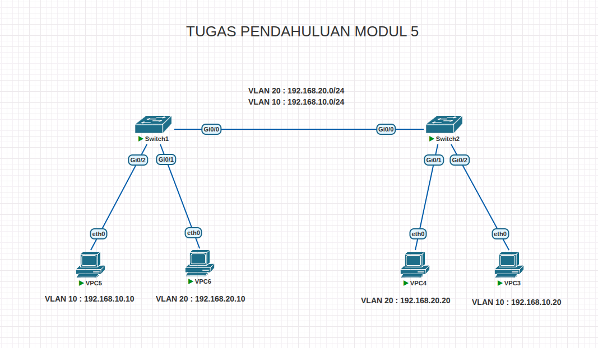

| PC  | Switch | VLAN | Nama VLAN | IP Address       |
| --- | ------ | ---: | --------- | ---------------- |
| PC5 | SW1    |   10 | FINANCE   | 192.168.10.10/24 |
| PC3 | SW2    |   10 | FINANCE   | 192.168.10.20/24 |
| PC6 | SW1    |   20 | HR        | 192.168.20.10/24 |
| PC4 | SW2    |   20 | HR        | 192.168.20.20/24 |

## 1.2 Tugas
1. Membuat VLAN 10 dan VLAN 20 pada SW1.
2. Membuat VLAN 10 dan VLAN 20 pada SW2.
3. Mengatur port PC sebagai access port sesuai VLAN masing-masing.
4. Mengatur link antara SW1 dan SW2 sebagai trunk.
5. Mengizinkan VLAN 10 dan VLAN 20 lewat pada trunk.
6. Memberikan IP address pada setiap VPCS.
7. Melakukan pengujian ping.
8. Pc pada vlan 10 bisa saling terhubung.
9. Pc pada vlan 20 bisa saling terhubung. 
10. 

## 1.3 Laporan
1. Screenshot topologi.
2. Screenshot dan jelaskan perintah show vlan brief pada SW1 dan SW2.
3. Screenshot dan jelaskan perintah show interfaces trunk pada SW1 dan SW2.
4. Screenshot IP setiap VPCS.
5. Screenshot ping PC1 ke PC3 berhasil.
6. Screenshot ping PC2 ke PC4 berhasil.
7. Screenshot ping beda VLAN gagal.

# Tugas Pendahuluan 2
1. Buat topologi modul 5 agar waktu praktikum sudah siap tinggal konfigurasi saja (kerjakan secara berkelompok).
2. Pastikan interface link antara perangkat sesuai dengan topologi modul 5.
3. Topologi tidak perlu mirip 100% yang penting adalah link antara perangkat sesuai.


# Dasar Teori
## 1. VLAN (Virtual Local Area Network)
VLAN (Virtual Local Area Network) adalah teknologi jaringan yang memungkinkan pembagian satu jaringan fisik menjadi beberapa jaringan logis yang terpisah. VLAN bekerja dengan cara menandai (tagging) paket data menggunakan VLAN ID, sehingga switch hanya mengirimkan data ke port yang termasuk dalam VLAN yang sama. Dengan demikian, meskipun perangkat terhubung ke switch yang sama secara fisik, mereka dapat diisolasi secara logis untuk meningkatkan keamanan dan efisiensi jaringan.

## 2. Access Port 
Access port adalah jenis port pada switch yang dikonfigurasi untuk menghubungkan perangkat akhir (end-device) seperti PC, printer, atau server ke satu VLAN tertentu saja. Traffic yang melewati access port bersifat untagged, artinya tidak ada label VLAN yang ditambahkan pada frame. Sebagai contoh, port yang dikonfigurasi sebagai access port pada VLAN 10 hanya akan mengirim dan menerima trafik dari VLAN 10.

## 3. Trunk Port
Trunk port adalah jenis port pada switch yang dikonfigurasi untuk membawa traffic dari beberapa VLAN sekaligus melalui satu koneksi fisik. Port ini umumnya digunakan untuk menghubungkan antar-switch atau switch ke router. Traffic yang melewati trunk port bersifat tagged menggunakan protokol IEEE 802.1Q, di mana setiap frame diberi label berisi VLAN ID untuk mengidentifikasi asal VLAN-nya.
## 4. OSPF (Open Shortest Path First)
OSPF adalah protokol routing dinamis berbasis link-state yang digunakan dalam jaringan komputer berbasis IP. OSPF menggunakan algoritma Dijkstra untuk menghitung jalur terpendek (shortest path) antar router berdasarkan nilai cost pada setiap link. Protokol ini termasuk dalam kategori Interior Gateway Protocol (IGP) dan banyak digunakan pada jaringan skala menengah hingga besar seperti jaringan perusahaan dan ISP.

## 5. Cara Kerja OSPF   
OSPF bekerja melalui beberapa tahapan sebagai berikut:

1. **Neighbor Discovery** — Setiap router mengirimkan Hello Packet secara berkala ke router tetangga (neighbour) untuk membangun hubungan adjacency. Hello packet dikirim setiap 10 detik pada media broadcast dan 30 detik pada media point-to-point.

2. **Pertukaran LSA (Link State Advertisement)** — Setiap router membuat Link State Packet (LSP) yang berisi informasi topologi jaringan, kemudian mendistribusikannya ke semua neighbour router.

3. **Pembangunan LSDB (Link State Database)** — Setiap router menyimpan informasi yang diterima ke dalam Link State Database sehingga memiliki gambaran lengkap tentang topologi jaringan.

4. **Perhitungan SPF (Shortest Path First)** — Berdasarkan LSDB, setiap router menjalankan algoritma Dijkstra untuk menghitung jalur terpendek ke setiap tujuan dalam jaringan.

5. **Update Routing Table** — Hasil perhitungan SPF dimasukkan ke dalam tabel routing sebagai jalur terbaik untuk meneruskan paket data.

# Topologi Jaringan

## 1.1 Topologi Jaringan
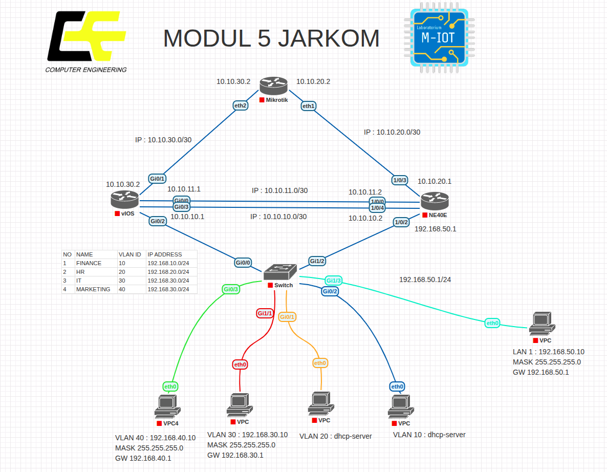

> [!WARNING]
> **DISCLAIMER:**
> Ada kesalahan pada dua link jalur cisco-huawei di topologi di atas. Seharusnya:
> - `g0/0` terhubung ke `ethernet 1/0/4`
> - `g0/3` terhubung ke `ethernet 1/0/0`

## 1.2 Tabel Addressing Vlan 

| VLAN ID | Nama VLAN | Network         | Gateway      | Keterangan  |
| ------: | --------- | --------------- | ------------ | ----------- |
|      10 | FINANCE   | 192.168.10.0/24 | 192.168.10.1 | DHCP Server |
|      20 | HR        | 192.168.20.0/24 | 192.168.20.1 | DHCP Server |
|      30 | IT        | 192.168.30.0/24 | 192.168.30.1 | Static IP   |
|      40 | MARKETING | 192.168.40.0/24 | 192.168.40.1 | Static IP   |

## 1.3 Tabel Addressing client 

| Perangkat     | VLAN | IP Address       | Gateway      | Keterangan                            |
| ------------- | ---: | ---------------- | ------------ | ------------------------------------- |
| PC Finance    |   10 | DHCP             | 192.168.10.1 | Mendapat IP otomatis dari DHCP Server |
| PC HR         |   20 | DHCP             | 192.168.20.1 | Mendapat IP otomatis dari DHCP Server |
| PC IT         |   30 | 192.168.30.10/24 | 192.168.30.1 | IP static                             |
| PC Marketing  |   40 | 192.168.40.10/24 | 192.168.40.1 | IP static                             |
| PC LAN Huawei |    - | 192.168.50.10/24 | 192.168.50.1 | LAN tambahan pada sisi Huawei         |

## 1.4 Tabel Link Antar Router 

| Link                  | Network       | Perangkat     | Interface     | IP Address    |
| --------------------- | ------------- | ------------- | ------------- | ------------- |
| Cisco ↔ Huawei Link 1 | 10.10.10.0/30 | Cisco Router  | Gi0/3         | 10.10.10.1/30 |
| Cisco ↔ Huawei Link 1 | 10.10.10.0/30 | Huawei Router | Ethernet1/0/0 | 10.10.10.2/30 |
| Cisco ↔ Huawei Link 2 | 10.10.11.0/30 | Cisco Router  | Gi0/0         | 10.10.11.1/30 |
| Cisco ↔ Huawei Link 2 | 10.10.11.0/30 | Huawei Router | Ethernet1/0/4 | 10.10.11.2/30 |
| Cisco ↔ MikroTik      | 10.10.30.0/30 | Cisco Router  | Gi0/1         | 10.10.30.2/30 |
| Cisco ↔ MikroTik      | 10.10.30.0/30 | MikroTik      | ether2        | 10.10.30.1/30 |
| MikroTik ↔ Huawei     | 10.10.20.0/30 | MikroTik      | ether1        | 10.10.20.2/30 |
| MikroTik ↔ Huawei     | 10.10.20.0/30 | Huawei Router | Ethernet1/0/3 | 10.10.20.1/30 |


# Praktikum 1 Konfigurasi Cisco Switch

> [!WARNING]
> **DISCLAIMER:**
> - Harus teliti dalam melakukan konfigurasi.
> - Saat menyalakan router/switch di awal mungkin butuh waktu agak lama.
> - Ketik perintah `do wr` (jika sedang di dalam mode config) atau `wr` (jika di luar mode config) setelah selesai konfigurasi untuk menyimpan pengaturan.

## Tujuan
Pada step pertama ini, Cisco Switch akan dikonfigurasi untuk:
1. Membuat VLAN 10, 20, 30, dan 40.
2. Mengatur port menuju PC sebagai access port.
3. Mengatur port menuju Cisco Router sebagai trunk port.
4. Mengatur port menuju Huawei LAN sebagai access port untuk network 192.168.50.0/24.

### 1. Masuk ke terminal Cisco Switch
```
Switch> enable
Switch# configure terminal
Switch(config)#
```
### 2. Membuat Vlan 

```
vlan 10
 name Finance
exit

vlan 20
 name HR
exit

vlan 30
 name IT
exit

vlan 40
 name Marketingg
exit

```
Verifikasi: 
```
show vlan brief

```

### 3. Pastikan vlan sudah dibuat dan statusnya aktif
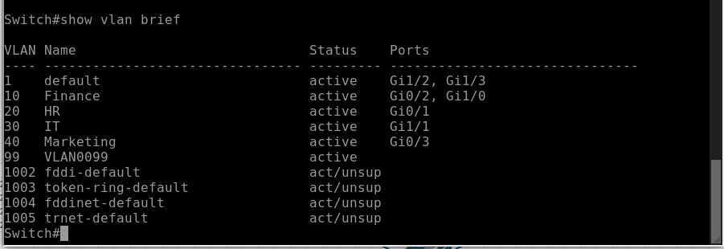


### 4. Konfigurasi Access port untuk setiap vlan

Port Access harus disesuaikan dengan interface pada cisco switch

```
Switch#conf t

interface gi0/2
 description PC-FINANCE-VLAN10
 switchport mode access
 switchport access vlan 10
 no shutdown
exit

interface gi0/1
 description PC-HR-VLAN20
 switchport mode access
 switchport access vlan 20
 no shutdown
exit

interface gi1/1
 description PC-IT-VLAN30
 switchport mode access
 switchport access vlan 30
 no shutdown
exit

interface gi0/3
 description PC-MARKETING-VLAN40
 switchport mode access
 switchport access vlan 40
 no shutdown
exit

```

### 5. Konfigurasi Trunk ke Cisco Router
Konfigurasi trunk port dari switch menuju cisco router untuk vlan 10, 20, 30, dan 40.

| Interface Switch | Terhubung ke       | Mode  | VLAN yang Dibawa |
| ---------------- | ------------------ | ----- | ---------------- |
| Gi0/0            | Cisco Router Gi0/2 | Trunk | 10,20,30,40      |

Konfigurasi:
```
Switch#conf t

interface gi0/0
 switchport trunk encapsulation dot1q
 description TRUNK-TO-CISCO-ROUTER
 switchport mode trunk
 switchport trunk allowed vlan 10,20,30,40
 no shutdown
exit
```

Verifikasi : 
```
show interfaces trunk   
```

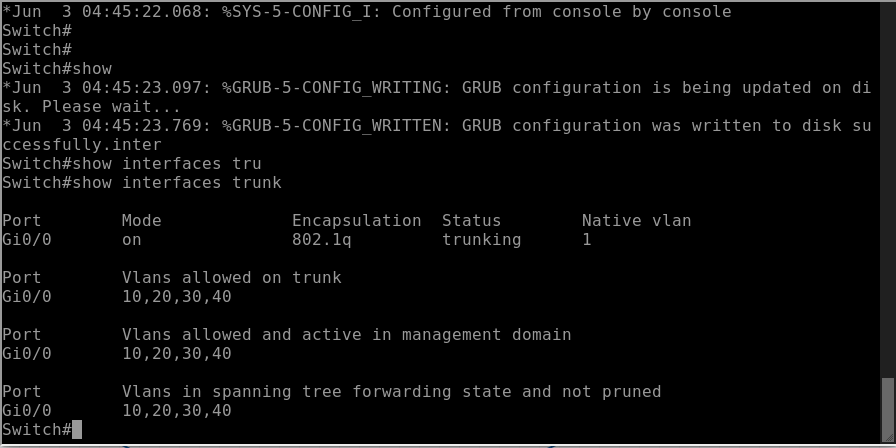

Save semua konfigurasi dengan perintah:
```
write memory
```


### 6. Hasil yang diharapkan
Praktikum 1 selesai jika konfigurasi memenuhi berikut:
1. Vlan 10, 20, 30, dan 40 sudah ada.
2. Trunk port sudah membawa vlan 10, 20, 30, dan 40.
3. Access port setiap vlan sudah sesuai.


# Praktikum 2 Konfigurasi Cisco Router

> [!WARNING]
> **DISCLAIMER:**
> - Harus teliti dalam melakukan konfigurasi.
> - Saat menyalakan router/switch di awal mungkin butuh waktu agak lama.
> - Ketik perintah `do wr` (jika sedang di dalam mode config) atau `wr` (jika di luar mode config) setelah selesai konfigurasi untuk menyimpan pengaturan.

## Tujuan
1. Cisco Router sebagai gateway untuk semua vlan
2. Cisco Router dikonfigurasi dhcp-server.
3. Implementasi ROAS (router-on-a-stick)

### 1. Masuk ke Cisco Router

```
enable
configure terminal
```

### 2. Konfigurasi Inteface Trunk ke Switch
Pilih interface yang terhubung ke Cisco Switch. Pada topologi, interface yang terhubung adalah Gig0/2

```
interface gig0/2
 description TRUNK-TO-CISCO-SWITCH
 no ip address
 no shutdown
 exit
```

### 3. Konfigurasi Subinterface VLAN 10

```
interface gig0/2.10
 description GATEWAY-VLAN10-FINANCE
 encapsulation dot1Q 10
 ip address 192.168.10.1 255.255.255.0
 no shutdown
exit
```

### 4. Konfigurasi Subinterface VLAN 20

```
interface gig0/2.20
 description GATEWAY-VLAN20-HR
 encapsulation dot1Q 20
 ip address 192.168.20.1 255.255.255.0
 no shutdown
 exit
```

### 5. Konfigurasi Subinterface VLAN 30

```
interface gig0/2.30
 description GATEWAY-VLAN30-IT
 encapsulation dot1Q 30
 ip address 192.168.30.1 255.255.255.0
 no shutdown
 exit
```

### 6. Konfigurasi Subinterface VLAN 40

```
interface gig0/2.40
 description GATEWAY-VLAN40-MARKETING
 encapsulation dot1Q 40
 ip address 192.168.40.1 255.255.255.0
 no shutdown
 exit
```

### 7. Konfigurasi DHCP-Server untuk Vlan 10
```
ip dhcp excluded-address 192.168.10.1 192.168.10.10

ip dhcp pool VLAN10-FINANCE
 network 192.168.10.0 255.255.255.0
 default-router 192.168.10.1
 dns-server 8.8.8.8
exit
```

### 8. Konfigurasi DHCP-Server untuk Vlan 20

```
ip dhcp excluded-address 192.168.20.1 192.168.20.10

ip dhcp pool VLAN20-HR
 network 192.168.20.0 255.255.255.0
 default-router 192.168.20.1
 dns-server 8.8.8.8
exit

```

### 9. Konfigurasi IP Static pada VPCS untul vlan 30 dan 40
PC Vlan 30 :
```
ip address 192.168.30.10/24 192.168.30.1

```
PC Vlan 40 :
```
ip address 192.168.40.10 192.168.40.1
```

PC Vlan 10 dan 20 menggunakan dhcp:

```
ip dhcp
```
### 10. Verifikasi Cisco Router
Cek interface:
```
show ip interface brief
```
Pastikan hasil adalah sebagai berikut:
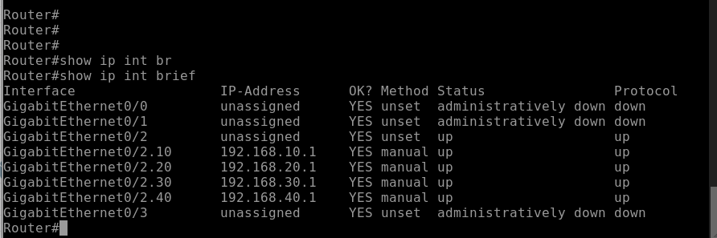

Cek dhcp pool:
```
show ip dhcp pool
```
Pastikan hasil adalah sebagai berikut:
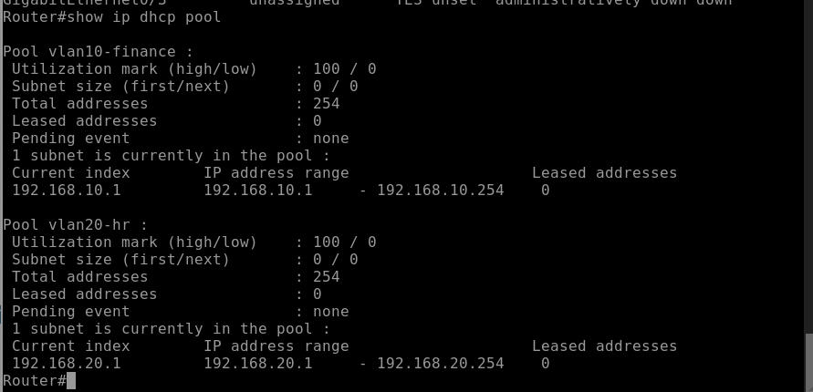

Cek client DHCP yang mendapatkan IP:

```
show ip dhcp binding
```

### 11. Pengujian dari VPCS
Masuk ke pc vlan 10 untuk request ip secara dhcp:
```
ip dhcp
```
Pastikan pc vlan 10 sudah dapat ip secara dhcp dengan command:
```
show ip
```
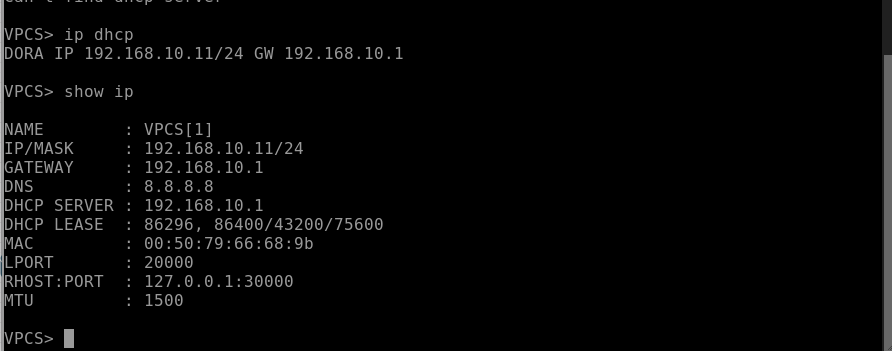

Dari pc vlan 10 ping gateway 192.168.10.1:
```
ping 192.168.10.1

```
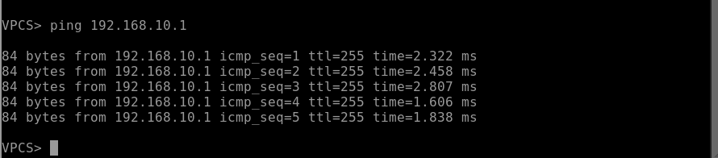

Masuk ke pc vlan 20 untuk request ip secara dhcp:
```
ip dhcp
```
Pastikan pc vlan 20 sudah dapat ip secara dhcp dengan command:
```
show ip
```
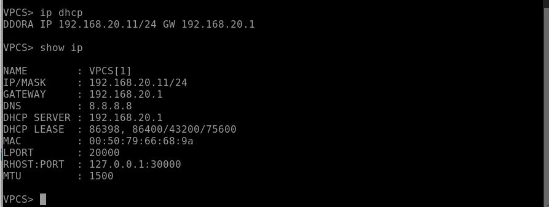

Dari pc vlan 20 ping gateway 192.168.20.1:

```
ping 192.168.20.1
```
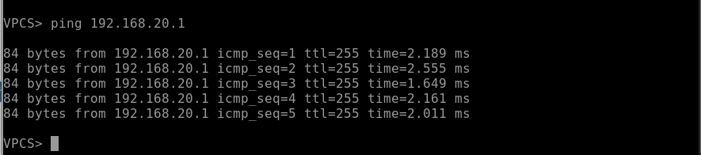

Dari pc vlan 30 ping gateway 192.168.30.1:
```
ping 192.168.30.1
```


Dari pc vlan 40 ping gateway 192.168.40.1:
```
ping 192.168.40.1

```
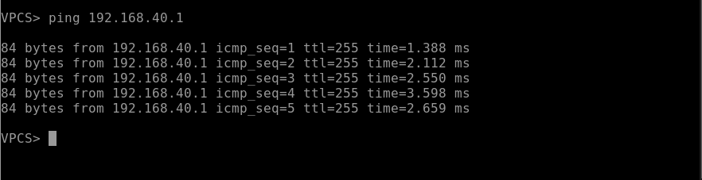

Uji ping antar-Vlan dari vlan 10:
```
ping 192.168.20.11
ping 192.168.30.10
ping 192.168.40.10
```
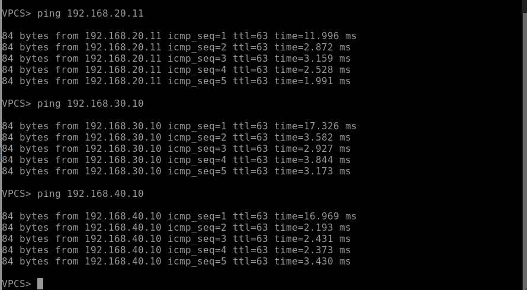

Masuk ke cisco router lagi untuk melihat ip dhcp binding:
```
show ip dhcp binding
```
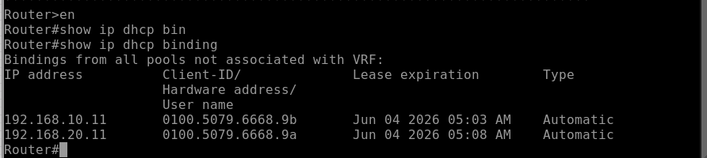

Amati IP yang diberikan oleh router ke client sesuai dengan ip di pc vlan 10 dan 20. 

### 12. Hasil yang diharapkan
Praktikum 2 berhasil jika memenuhi sebagai berikut:
1. Cisco Router memiliki subinterface VLAN 10, 20, 30, dan 40.
2. VLAN 10 mendapat gateway 192.168.10.1.
3. VLAN 20 mendapat gateway 192.168.20.1.
4. VLAN 30 mendapat gateway 192.168.30.1.
5. VLAN 40 mendapat gateway 192.168.40.1.
6. PC VLAN 10 dan VLAN 20 mendapatkan IP dari DHCP.
7. Semua PC dapat ping gateway masing-masing.
8. PC antar-VLAN dapat saling ping melalui Cisco Router.

# Praktikum 3 Konfigurasi Huawei Router dan IP Address Antarrouter

> [!WARNING]
> **DISCLAIMER:**
> - Config HUAWEI (Praktikum 3): Untuk menghapus ketikan (Backspace), gunakan kombinasi `CTRL + H`.
> - Jika konfigurasi sudah di-commit, indikator di terminal akan berubah menjadi `~` (tilde), bukan `*` (yang menandakan masih dalam proses edit/belum disave).

##  Tujuan

Pada praktikum ini, praktikan akan belajar untuk konfigurasi:
1. LAN pada sisi Huawei dengan network 192.168.50.0/24.
2. IP address link Cisco ↔ Huawei.
3. IP address link Huawei ↔ MikroTik.
4. IP address link Cisco ↔ MikroTik.
5. Pengujian konektivitas antarrouter sebelum masuk ke OSPF.

### 1. Konfigurasi Lan Huawei 

konfigurasi ip address untuk lan huawei:

```
system-view

interface Ethernet1/0/2
 description LAN-HUAWEI
 ip address 192.168.50.1 255.255.255.0
 undo shutdown
 quit

commit
```

### 2. Konfigurasi IP VPC Lan Huawei
Pada pc lan huawei:
```
ip 192.168.50.10/24 192.168.50.1
```
Verifikasi:
```
show ip
```
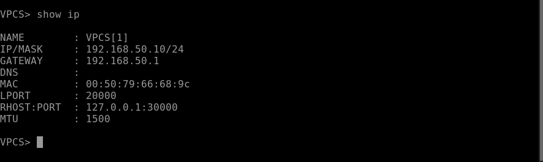

Testing ping gateway huawei:
```
ping 192.168.50.1
```

Pastikan hasilnya reply:

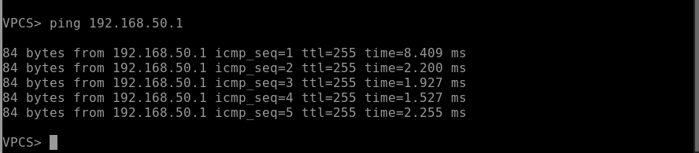

Target: 
PC lan Huawei dapat melakukan ping ke gateway 192.168.50.1

### 3. Konfigurasi IP link cisco <-> Huawei link 1
Network:
```
10.10.10.0/30
```
| Perangkat     | Interface     | IP Address    |
| ------------- | ------------- | ------------- |
| Cisco Router  | Gi0/3         | 10.10.10.1/30 |
| Huawei Router | Ethernet1/0/0 | 10.10.10.2/30 |

**Cisco Router**
```
enable
configure terminal

interface gi0/3
 description LINK1-TO-HUAWEI
 ip address 10.10.10.1 255.255.255.252
 no shutdown
exit
```

**Huawei Router**
```
system-view

interface Ethernet1/0/0
 description LINK1-TO-CISCO
 ip address 10.10.10.2 255.255.255.252
 undo shutdown
 quit

commit

```

### 4. Konfigurasi IP Link Cisco ↔ Huawei Link 2
Network:
```
10.10.11.0/30
```
| Perangkat     | Interface     | IP Address    |
| ------------- | ------------- | ------------- |
| Cisco Router  | Gi0/0         | 10.10.11.1/30 |
| Huawei Router | Ethernet1/0/4 | 10.10.11.2/30 |

**Cisco Router**
```
interface gi0/0
 description LINK2-TO-HUAWEI
 ip address 10.10.11.1 255.255.255.252
 no shutdown
exit
```
**Huawei Router**
```
system-view

interface Ethernet1/0/4
 description LINK2-TO-CISCO
 ip address 10.10.11.2 255.255.255.252
 undo shutdown
 quit

commit
```

### 5. Konfigurasi IP link Huawei <-> Mikrotik
Network:
```
10.10.20.0/30

```
| Perangkat     | Interface     | IP Address    |
| ------------- | ------------- | ------------- |
| Huawei Router | Ethernet1/0/3 | 10.10.20.1/30 |
| MikroTik      | ether1        | 10.10.20.2/30 |

**Huawei Router**
```
system-view

interface Ethernet1/0/3
 description LINK-TO-MIKROTIK
 ip address 10.10.20.1 255.255.255.252
 undo shutdown
 quit

commit
```

**Mikrotik**
```
/ip address add address=10.10.20.2/30 interface=ether1 comment=TO-HUAWEI

```

### 6. Konfigurasi IP link Cisco <-> Mikrotik
Network:
```
10.10.30.0/30
```
| Perangkat    | Interface | IP Address    |
| ------------ | --------- | ------------- |
| Cisco Router | Gi0/1     | 10.10.30.1/30 |
| MikroTik     | ether2    | 10.10.30.2/30 |

**Cisco Router**
```
interface gi0/1
 description LINK-TO-MIKROTIK
 ip address 10.10.30.1 255.255.255.252
 no shutdown
exit
```

**Mikrotik**
```
/ip address add address=10.10.30.2/30 interface=ether2 comment=TO-CISCO
```

### 7. Verifikasi Interface
**Cisco Router**
```
show ip interface brief
```
Pastikan ip pada interface berikut sudah aktif:
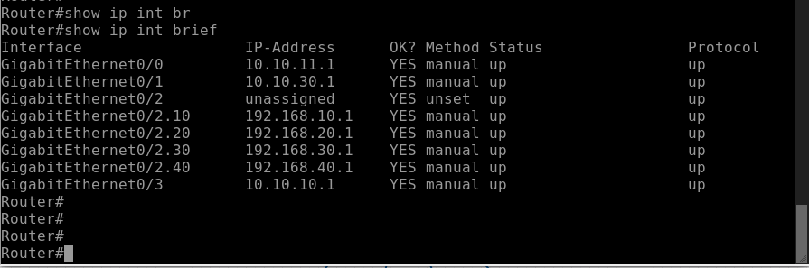
**Huawei Router**
```
display ip interface brief
```
Pastikan ip sudah sesuai pada interface dan statusnya up:
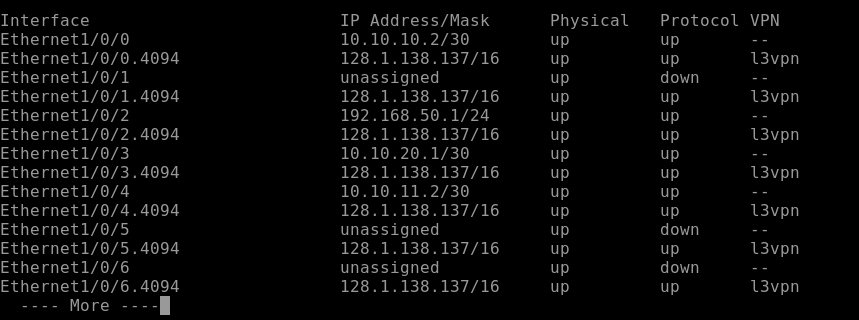


**Mikrotik**
```
/ip address print
```
pastikan ip berikut sesuai:

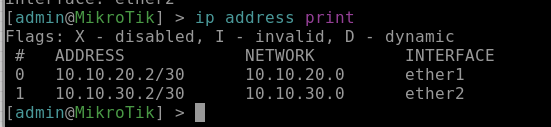

### 8. Verifikasi ping Antar Router
**Dari Cisco Router**
```
ping 10.10.10.2
ping 10.10.11.2
ping 10.10.30.2
```
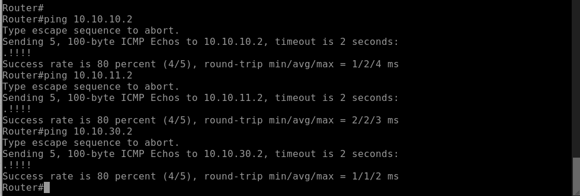

Target:

Cisco harus bisa ping ke huawei dan mikrotik.

**Dari Router Huawei**
```
ping 10.10.10.1
ping 10.10.11.1
ping 10.10.20.2
```
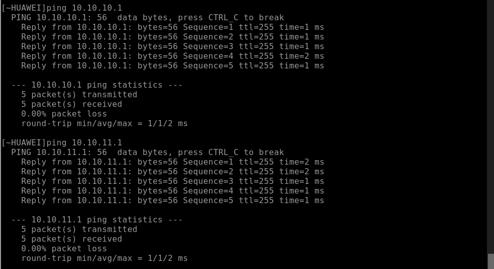
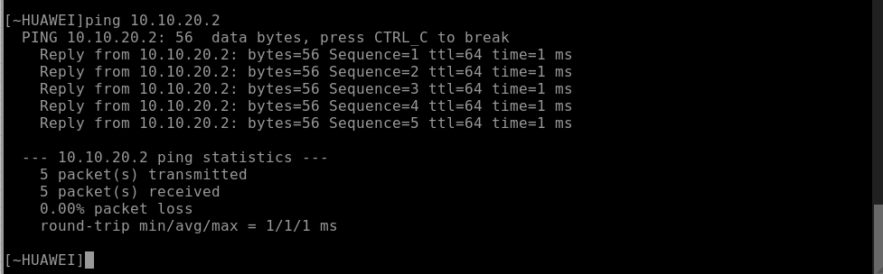

Target:
Huawei harus bisa ping cisco dan mikrotik.

**Dari Router Mikrotik**
```
ping 10.10.20.1
ping 10.10.30.1
```
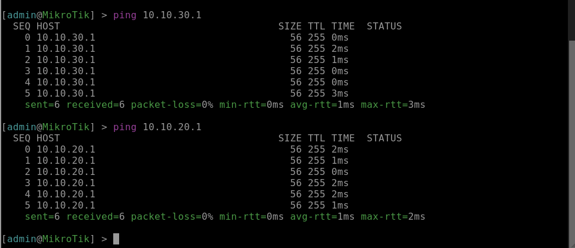

Target:
Mikrotik harus bisa ping ke cisco dan huawei.

### 9. Hasil yang diharapkan
1. Praktikum 3 berhasil jika konfigurasi memenuhi berikut ini:
2. LAN Huawei 192.168.50.0/24 aktif.
3. VPC LAN Huawei dapat ping gateway 192.168.50.1.
4. Link Cisco ↔ Huawei pertama aktif.
5. Link Cisco ↔ Huawei kedua aktif.
6. Link Huawei ↔ MikroTik aktif.
7. Link Cisco ↔ MikroTik aktif.
8. Semua router dapat ping ke router tetangga langsung.

#  Praktikum 4 Konfigurasi OSPF Multivendor dan OSPF Cost

> [!WARNING]
> **DISCLAIMER:**
> - Routing Interface Huawei pastikan harus sesuai dengan konfigurasi masing-masing!

## Tujuan
Pada praktikum ini, praktikan mengkonfigurasi routing dinamis menggunakan OSPF pada tiga perangkat berbeda:
1. Cisco Router
2. Huawei Router
3. Mikrotik Router

### 1. Konsep routing ospf pada topologi
Pada topologi ini, cisco router dan huawei memiliki 2 jalur utama. Lalu, mikrotik digunakan sebagai jalur cadangan jika 2 link utama tidak berfungsi. 

| Link                  | Cost | Fungsi       |
| --------------------- | ---: | ------------ |
| Cisco ↔ Huawei Link 1 |   10 | Jalur utama  |
| Cisco ↔ Huawei Link 2 |   10 | Jalur utama  |
| Cisco ↔ MikroTik      |  100 | Jalur backup |
| Huawei ↔ MikroTik     |  100 | Jalur backup |

### 2. Network yang diiklankan ke ospf

**Cisco Router**
| Network         | Keterangan          |
| --------------- | ------------------- |
| 10.10.10.0/30   | Link Cisco-Huawei 1 |
| 10.10.11.0/30   | Link Cisco-Huawei 2 |
| 10.10.30.0/30   | Link Cisco-MikroTik |
| 192.168.10.0/24 | VLAN 10 Finance     |
| 192.168.20.0/24 | VLAN 20 HR          |
| 192.168.30.0/24 | VLAN 30 IT          |
| 192.168.40.0/24 | VLAN 40 Marketing   |

**Huawei Router**
| Network         | Keterangan           |
| --------------- | -------------------- |
| 10.10.10.0/30   | Link Huawei-Cisco 1  |
| 10.10.11.0/30   | Link Huawei-Cisco 2  |
| 10.10.20.0/30   | Link Huawei-MikroTik |
| 192.168.50.0/24 | LAN Huawei           |

**Mikrotik**
| Network       | Keterangan           |
| ------------- | -------------------- |
| 10.10.20.0/30 | Link MikroTik-Huawei |
| 10.10.30.0/30 | Link MikroTik-Cisco  |

### 3. Konfigurasi ospf pada Cisco Router
Masuk ke Cisco Router:
```
enable
configure terminal
```
Konfigurasi OSPF:
```
router ospf 1
 router-id 1.1.1.1
 network 10.10.10.0 0.0.0.3 area 0
 network 10.10.11.0 0.0.0.3 area 0
 network 10.10.30.0 0.0.0.3 area 0
 network 192.168.10.0 0.0.0.255 area 0
 network 192.168.20.0 0.0.0.255 area 0
 network 192.168.30.0 0.0.0.255 area 0
 network 192.168.40.0 0.0.0.255 area 0
exit
```
Atur OSPF cost pada interface Cisco.
```
interface gi0/3
 description LINK1-TO-HUAWEI
 ip ospf cost 10
exit

interface gi0/0
 description LINK2-TO-HUAWEI
 ip ospf cost 10
exit

interface gi0/1
 description LINK-TO-MIKROTIK
 ip ospf cost 100
exit
```

Verifikasi OSPF Cisco:
```
show ip ospf neighbor
show ip route ospf
```
Hasil kemungkinan kosong karena router tetangga masih belum dikonfigurasi
```
show ip protocols

```
Pastikan network yang akan diiklankan sudah ada:
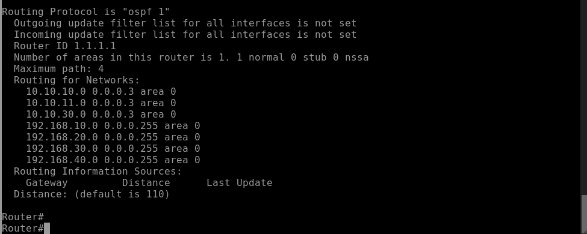

### 4. Konfigurasi OSPF pada Huawei Router
Masuk ke huawei router:
```
system-view
```
Konfigurasi OSPF:
```
ospf 1 router-id 2.2.2.2
 area 0.0.0.0
  network 10.10.10.0 0.0.0.3
  network 10.10.11.0 0.0.0.3
  network 10.10.20.0 0.0.0.3
  network 192.168.50.0 0.0.0.255
 quit
quit
```
Atur OSPF cost pada interface huawei.
```
interface Ethernet1/0/0
 description LINK1-TO-CISCO
 ospf cost 10
 quit

interface Ethernet1/0/4
 description LINK2-TO-CISCO
 ospf cost 10
 quit

interface Ethernet1/0/3
 description LINK-TO-MIKROTIK
 ospf cost 100
 quit

commit
```
Verifikasi OSPF Huawei:
```
display ospf peer
```
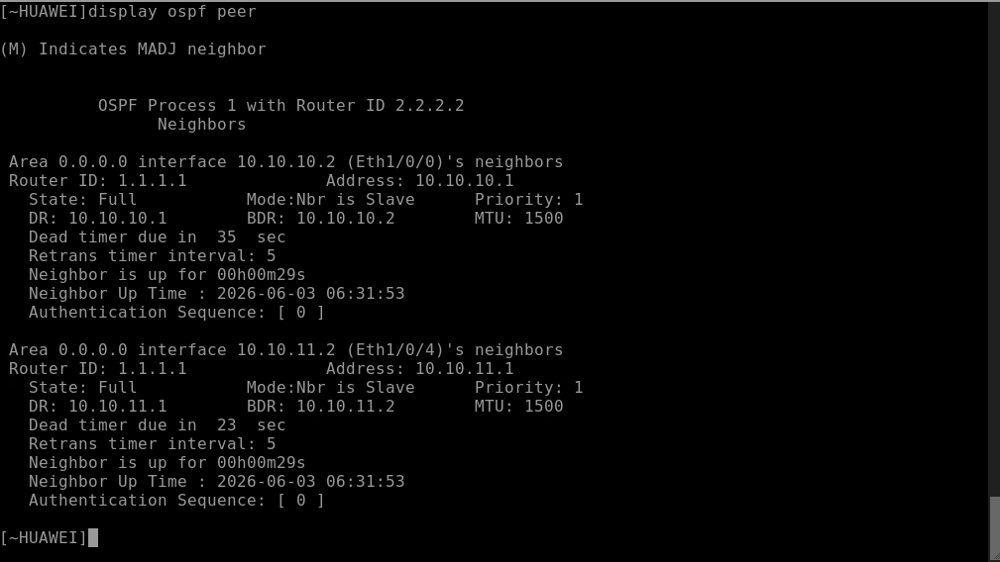

Pastikan huawei peer dengan cisco melalui 2 link utama.

```
display ip routing-table protocol ospf

```
Pastikan hauwei sudah punya mendapatkan network lengkap dari cisco.

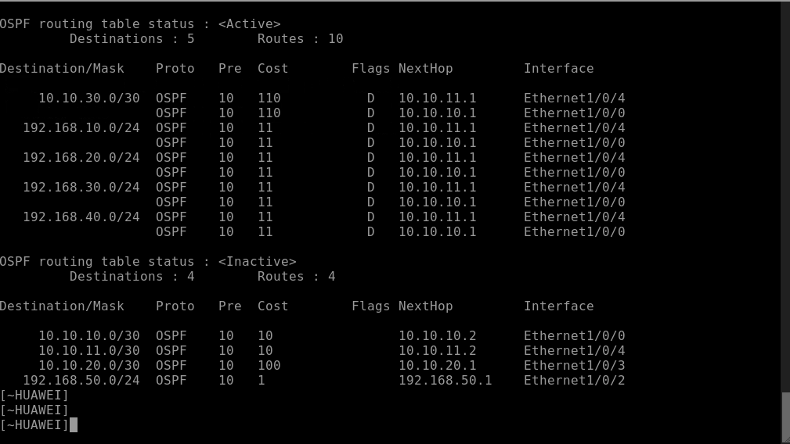

```
display ospf routing

```
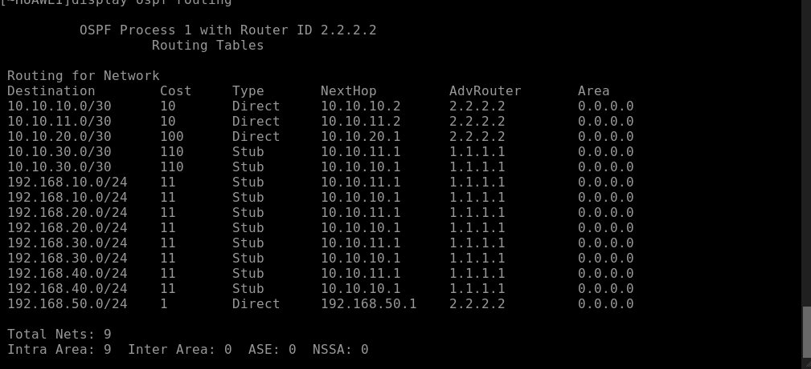

### 5. Konfigurasi OSPF pada MikroTik
Pada topologi ini, Mikrotik digunakan sebagai jalur backup antara cisco dan huawei.

Network Mikrotik:
| Link              | Interface MikroTik | IP Address    |
| ----------------- | ------------------ | ------------- |
| MikroTik ↔ Huawei | ether1             | 10.10.20.2/30 |
| MikroTik ↔ Cisco  | ether2             | 10.10.30.2/30 |

Masuk ke terminal Mikrotik, lalu konfigurasi router-id OSPF:
```
/routing ospf instance set default router-id=3.3.3.3
```
Tambahkan network OSPF:
```
/routing ospf network add network=10.10.20.0/30 area=backbone
/routing ospf network add network=10.10.30.0/30 area=backbone
```
Atur cost interface mikrotik menjadi jalur bakcup:
```
/routing ospf interface add interface=ether1 cost=100
/routing ospf interface add interface=ether2 cost=100
```

**Verifikasi Mikrotik**
```
/routing ospf neighbor print
```
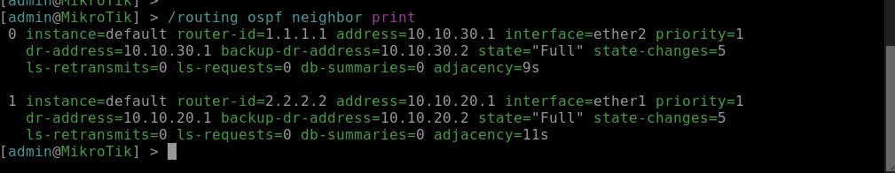

Pastikan router id cisco dan huawei sudah muncul dimikrotik

Cek routing table OSPF:
```
/ip route print where ospf
```
Hasil yang diharapkan:
```
MikroTik mendapatkan route OSPF menuju VLAN 10, 20, 30, 40 dan LAN Huawei 192.168.50.0/24.

```
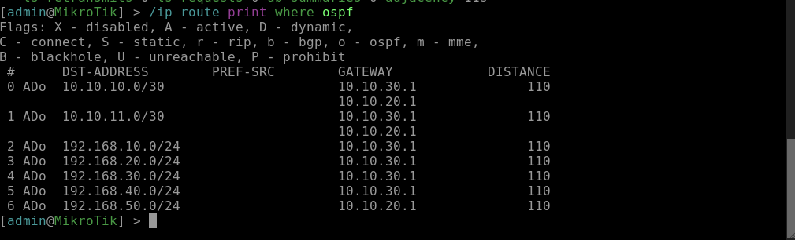

### 6. Verifikasi OSPF Neighbor
**Cisco Router**
```
show ip ospf neigbor
```
Hasil yang diharapkan:
```
Neighbor Huawei muncul dua kali.
Neighbor MikroTik muncul satu kali.
```
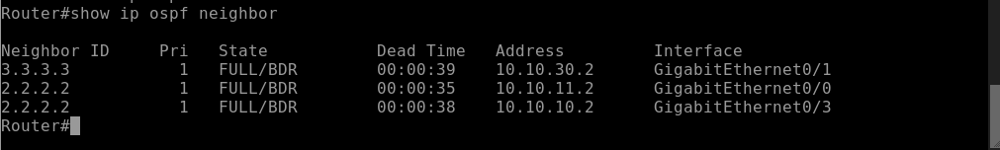

**Huawei Router**
```
display ospf peer
```
Hasil yang diharapkan:
```
Peer ospf muncul dua kali.
Peer mikrotik muncul satu kali.
```
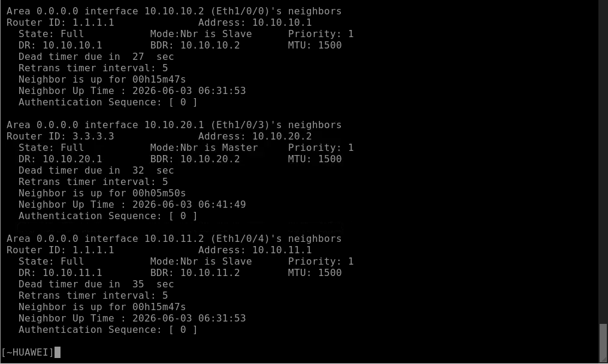

**Mikrotik**
```
/routing ospf neighbor print
```
Hasil yang diharapkan:
```
Neighbor cisco muncul.
Neigbor Huawei muncul.
```


### 7. Verifikasi Routing Table
**Cisco Router**
Cek route menuju lan huawei:
```
show ip route 192.168.50.0
```
Hasil yang diharapkan pada kondisi normal:
```
Jalur menuju network 192.168.50.0/24 melewati cisco-huawei. Jika dua next-hop muncul, artinya ospf menggunakan dua link utama
```
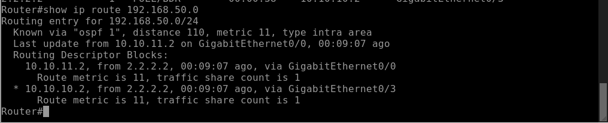

Cek semua route ospf:
```
show ip route ospf
```
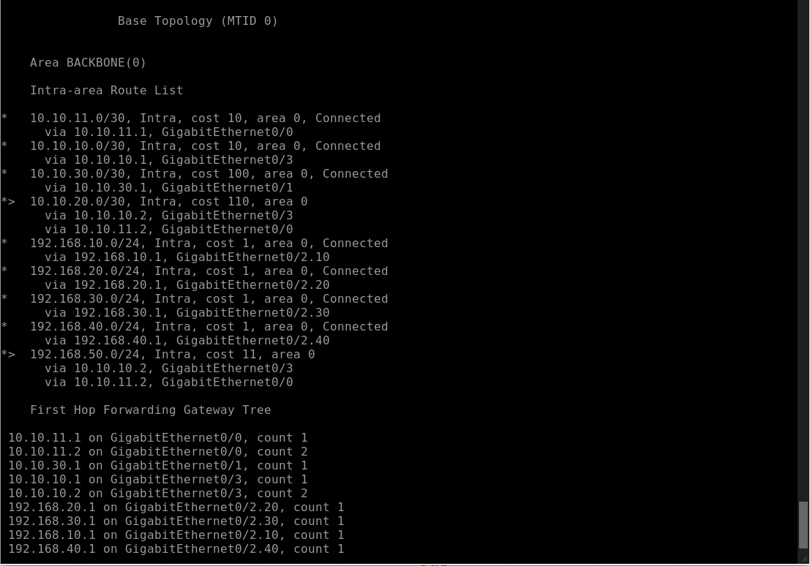

**Huawei Router**

Cek semua route ospf:
```
display-ip routing table protocol ospf
```
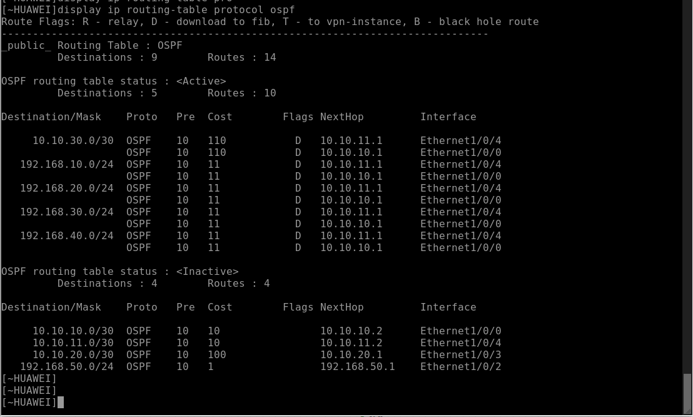

**Mikrotik**
```
/ip route print where ospf
```
Hasil yang diharapkan:
```
Mikrotik memiliki route ospf ke cisco dan huawei.
```
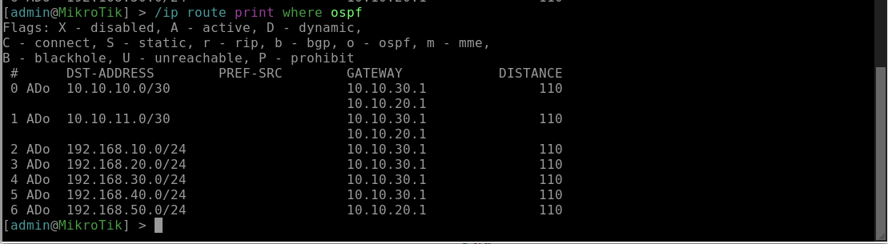

### 8. Verifikasi Koneksi end-to-end
Lakukan pengujian dari pc vlan menuju lan hauwei.

Dari pc vlan 10:
```
ping 192.168.50.10
```
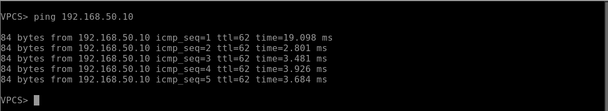

Dari pc vlan 20:
```
ping 192.168.50.10
```


Dari pc vlan 30:
```
ping 192.168.50.10
```


Dari pc vlan 40:
```
ping 192.168.50.10
```


Lakukan pengujian dari pc lan huawei ke ip vlan cisco:
```
ping 192.168.10.11
ping 192.168.20.11
ping 192.168.30.10
ping 192.168.40.10

```
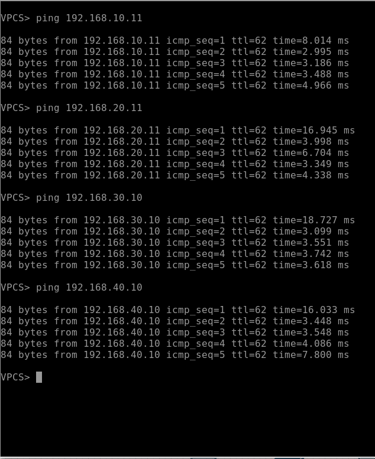

### 9. Hasil yang diharapkan
Praktikum 4 berhasil jika:
1. Cisco Router membentuk OSPF neighbor dengan Huawei dan MikroTik.
2. Huawei Router membentuk OSPF peer dengan Cisco dan MikroTik.
3. MikroTik membentuk OSPF neighbor dengan Cisco dan Huawei.
4. Cisco mendapatkan route OSPF menuju LAN Huawei 192.168.50.0/24.
5. Huawei mendapatkan route OSPF menuju VLAN 10, 20, 30, dan 40.
6. MikroTik mendapatkan route OSPF menuju semua network.
7. PC VLAN 10, 20, 30, dan 40 dapat ping PC LAN Huawei.
8. PC LAN Huawei dapat ping ke network VLAN Cisco.


# Praktikum 5 Pengujian Failover OSPF

### 1. Kondisi normal: Dua link cisco-huawei aktif

Cek route dari cisco menuju lan huawei:
```
show ip route 192.168.50.0
```
Lakukan trace dari pc vlan menuju lan huawei:
```
trace 192.168.50.10
```

Hasil yang diharapkan:
```
Traffic melewati jalur langsung Cisco → Huawei.
```
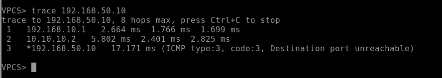

### 2. Kondisi 1 link cisco-huawei mati

Matikan salah satu link cisco-huawei.
```
configure terminal
interface gi0/3
 shutdown
exit

```
Cek route dari cisco menuju lan huawei:
```
show ip route 192.168.50.0
```

Lakukan trace dari pc vlan menuju lan huawei:
```
trace 192.168.50.10
```

Hasil yang diharapkan:
```
Traffic tetap melewati jalur langsung Cisco
```
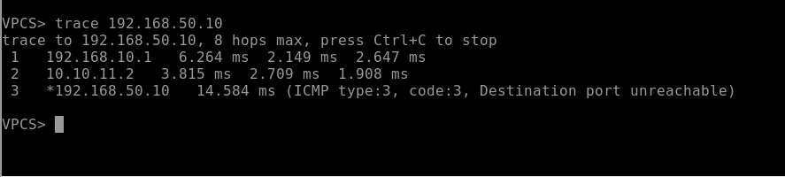

### 3. Kondisi dua link cisco-huawei mati
Matikan link cisco-huawei yang kedua:
```
configure terminal
interface gi0/0
 shutdown
exit

```
Cek route dari cisco menuju lan huawei:
```
show ip route 192.168.50.0
```
Lakukan trace dari pc vlan menuju lan huawei:
```
trace 192.168.50.10
```

Hasil yang diharapkan:
```
Route berpindah ke jalur backup melalui MikroTik.

Jalur:
PC VLAN → Cisco Router → MikroTik → Huawei Router → LAN Huawei
```
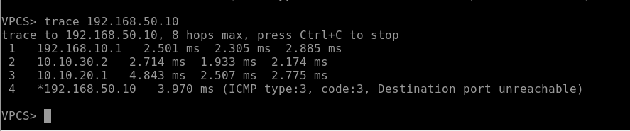

### 4. Mengaktifkan kembali dua link cisco huawei
```
configure terminal
interface gi0/3
 no shutdown
exit

interface gi0/0
 no shutdown
exit
```
Cek route dari cisco menuju lan huawei:
```
show ip route 192.168.50.0
```
Lakukan trace dari pc vlan menuju lan huawei:
```
trace 192.168.50.10
```
Hasil yang diharapkan:
```
Jalur routing kembali pindah ke link utama cisco-huawei.
```
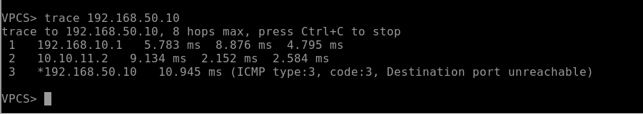

### 5. Bukti yang dikumpulkan
1. Screenshot trace 192.168.50.10 saat dua link aktif.
2. Screenshot trace 192.168.50.10 saat satu link mati.
3. Screenshot trace 192.168.50.10 yang menunjukkan jalur melewati MikroTik.


# Tugas Modul
(Menyusul)


           


